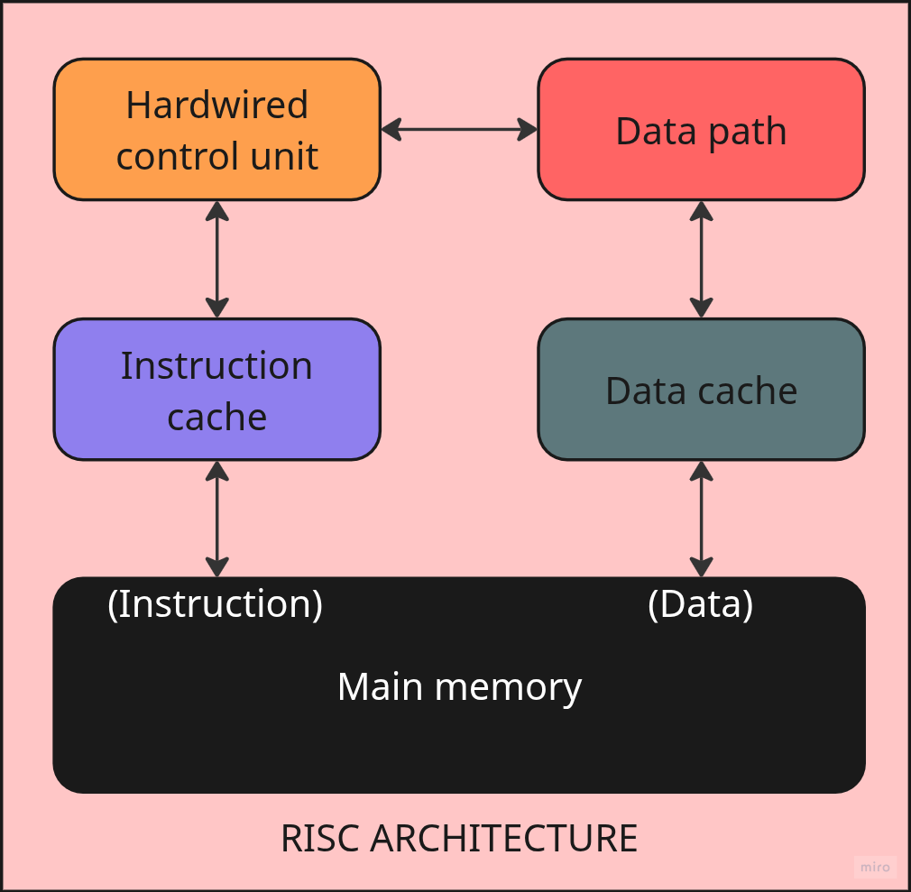
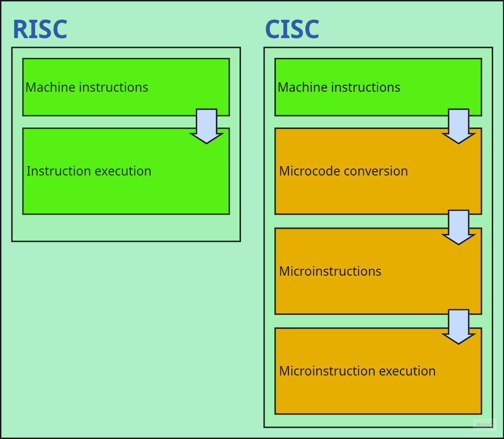
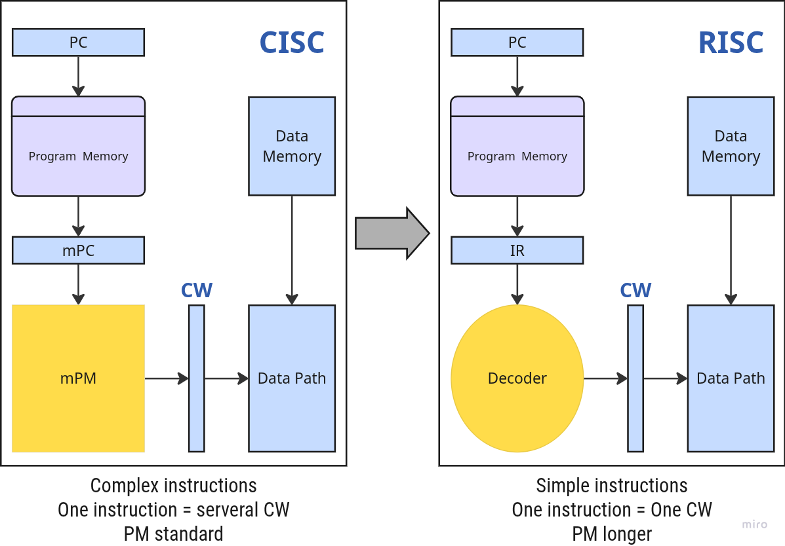
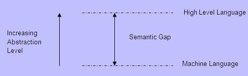
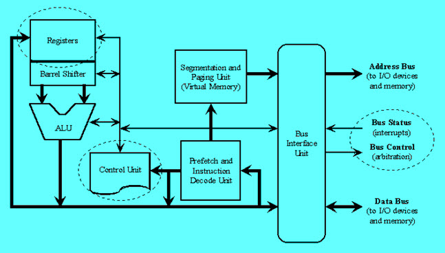
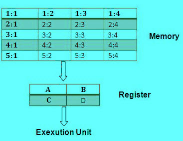

# Kiến trúc RISC và CISC
> Kiến trúc RISC và CISC là gì và sự khác biệt của chúng

Kiến trúc của Bộ xử lý trung tâm (CPU) vận hành khả năng hoạt động từ "Kiến trúc tập lệnh" đến nơi nó được thiết kế. Thiết kế kiến ​​trúc của CPU là **Máy tính tập lệnh rút gọn (RISC)** và **Máy tính tập lệnh phức tạp (CISC)**. CISC có khả năng thực hiện các hoạt động nhiều bước hoặc chế độ địa chỉ trong một tập lệnh. Đây là thiết kế CPU trong đó một lệnh thực hiện nhiều hành động cấp thấp. Ví dụ, lưu trữ bộ nhớ, tải từ bộ nhớ và một phép toán số học. Máy tính tập lệnh rút gọn là một chiến lược thiết kế Bộ xử lý trung tâm dựa trên tầm nhìn rằng tập lệnh cơ bản mang lại hiệu suất tuyệt vời khi kết hợp với kiến ​​trúc vi xử lý có khả năng thực hiện các lệnh bằng cách sử dụng một số chu kỳ vi xử lý cho mỗi lệnh. Bài viết này thảo luận về kiến ​​trúc RISC và CISC với các sơ đồ phù hợp.

Phần cứng của Intel được đặt tên là Máy tính tập lệnh phức tạp (CISC) và phần cứng của Apple là Máy tính tập lệnh rút gọn (RISC).

## RISC và CISC là gì?

Máy tính có tập lệnh phức hợp là máy tính mà các lệnh đơn có thể thực hiện nhiều thao tác cấp thấp như tải từ bộ nhớ, phép toán số học và lưu trữ bộ nhớ hoặc được thực hiện bằng các quy trình nhiều bước hoặc chế độ địa chỉ trong các lệnh đơn, như tên gọi của nó đề xuất "Bộ lệnh phức hợp". Máy tính có tập lệnh rút gọn là máy tính chỉ sử dụng các lệnh đơn giản có thể được chia thành nhiều lệnh để thực hiện thao tác cấp thấp trong một chu kỳ **CLK** _(clock)_ duy nhất, như tên gọi của nó đề xuất "Bộ lệnh rút gọn"

### Kiến trúc RISC

Thuật ngữ RISC là viết tắt của "Máy tính có tập lệnh rút gọn". Đây là một kế hoạch thiết kế CPU dựa trên các lệnh đơn giản và hoạt động nhanh. Đây là tập lệnh nhỏ hoặc rút gọn. Ở đây, mọi lệnh đều được mong đợi đạt được các công việc rất nhỏ. Trong máy này, các tập lệnh khiêm tốn và đơn giản, giúp bao gồm các lệnh phức tạp hơn. Mỗi lệnh có độ dài tương đương nhau; chúng được kết hợp với nhau để hoàn thành các tác vụ phức hợp trong một thao tác duy nhất. Hầu hết các lệnh được hoàn thành trong một chu kỳ máy. Đường ống này là một kỹ thuật quan trọng được sử dụng để tăng tốc máy RISC.

<figure markdown="span">
    
    <figcaption></figcaption>
</figure>

Máy tính có bộ lệnh rút gọn là một bộ vi xử lý được thiết kế để thực hiện một số lệnh cùng một lúc. Dựa trên các lệnh nhỏ, các chip này cần ít bóng bán dẫn hơn, giúp thiết kế và sản xuất bóng bán dẫn không tốn kém. Các tính năng của RISC bao gồm:

- Nhu cầu giải mã ít hơn
- Ít kiểu dữ liệu trong phần cứng
- Thanh ghi mục đích chung
- Giống hệt nhau
- Bộ lệnh thống nhất
- Các nút định địa chỉ đơn giản.

Ngoài ra, khi viết chương trình, RISC giúp lập trình viên máy tính dễ dàng hơn bằng cách loại bỏ các mã không cần thiết và ngừng lãng phí chu kỳ.

### Kiến trúc CISC

Thuật ngữ CISC là viết tắt của ''Máy tính có bộ lệnh phức tạp''. Đây là một kế hoạch thiết kế CPU dựa trên các lệnh đơn, có kỹ năng thực hiện các hoạt động nhiều bước. Máy tính CISC có các chương trình nhỏ. Nó có một số lượng lớn các lệnh hợp thành, mất nhiều thời gian để thực hiện. Ở đây, một bộ lệnh duy nhất được bảo vệ trong nhiều bước; mỗi bộ lệnh có hơn 300 lệnh riêng biệt. Tối đa các lệnh được hoàn thành trong hai đến mười chu kỳ máy. Trong CISC, đường ống lệnh không dễ triển khai. Kiến trúc CISC Các máy CISC có các hoạt động tốt, dựa trên tổng quan về trình biên dịch chương trình; vì một loạt các hướng dẫn cải tiến chỉ có thể đạt được trong một tập lệnh. Họ thiết kế các hướng dẫn phức hợp trong một tập hợp các hướng dẫn đơn giản. Chúng đạt được các quy trình cấp thấp, giúp dễ dàng có các nút địa chỉ khổng lồ và các kiểu dữ liệu bổ sung trong phần cứng của máy. Tuy nhiên, CISC được coi là kém hiệu quả hơn RISC, vì nó không đủ khả năng để loại bỏ các mã dẫn đến lãng phí chu trình. Ngoài ra, các chip vi xử lý rất khó hiểu và khó lập trình vì sự phức tạp của phần cứng. Các bộ xử lý RISC có một tập hợp các lệnh nhỏ hơn với ít các nút địa chỉ. Các bộ xử lý CISC có một tập hợp các lệnh lớn hơn với nhiều nút địa chỉ.

<figure markdown="span">
        
    <figcaption></figcaption>
</figure>

## RISC Vs CISC

|                    | RISC                                                                            | CISC                                                     |
| :----------------- | :------------------------------------------------------------------------------ | :------------------------------------------------------- |
| Memory Unit        | RISC không có bộ nhớ và sử dụng một phần cứng riêng biệt để triển khai các lệnh | CISC có một đơn vị bộ nhớ để thực hiện các lệnh phức tạp |
| Chương trình       | RISC có một đơn vị lập trình có dây cứng                                        | CISC có một đơn vị vi lập trình                          |
| Thiết kế           | RISC là một thiết kế trình biên dịch phức tạp                                   | CISC là một thiết kế trình biên dịch dễ dàng             |
| Các phép tính      | RISC nhanh hơn và chính xác hơn                                                 | Tính toán CISC chậm và chính xác                         |
| Giải mã            | Việc giải mã các lệnh của RISC rất đơn giản                                     | Việc giải mã các lệnh trong CISC là phức tạp             |
| Thời gian thực thi | Thời gian thực thi trong RISC là rất ít                                         | Thời gian thực thi trong CISC rất cao                    |
| Bộ nhớ ngoài       | RISC không yêu cầu bộ nhớ ngoài để tính toán                                    | CISC yêu cầu bộ nhớ ngoài để tính toán                   |
| Pipelining         | RISC Pipelining hoạt động chính xác                                             | CISC Pipelining không hoạt động chính xác                |
| Stalling           | RISC đình trệ hầu hết được giảm trong bộ xử lý                                  | Các bộ xử lý CISC thường bị đình trệ                     |
| Mở rộng Mã         | Mở rộng Mã có thể là một vấn đề trong RISC                                      | Mở rộng Mã không phải là một vấn đề                      |

Các ví dụ tốt nhất về kiến ​​trúc tập lệnh CISC bao gồm VAX, PDP-11, Motorola 68k và PC để bàn của bạn trên kiến ​​trúc x86 của Intel, trong khi các ví dụ tốt nhất về kiến ​​trúc RISC bao gồm DEC Alpha, ARC, AMD 29k, Atmel AVR, Intel i860, Blackfin , i960, Motorola 88000, MIPS, PA-RISC, Power, SPARC, SuperH và ARM cũng vậy. Các ứng dụng của RISC và CISCRISC được sử dụng trong các ứng dụng cao cấp như xử lý video, viễn thông và xử lý hình ảnh. CISC được sử dụng trong các ứng dụng cấp thấp như hệ thống an ninh, tự động hóa gia đình, v.v. Từ sự so sánh ở trên giữa RISC và CISC, cuối cùng, chúng ta có thể kết luận rằng chúng ta không thể phân biệt giữa công nghệ RISC và CISC vì cả hai đều phù hợp với ứng dụng chính xác của nó. Ngày nay, cả các nhà thiết kế RISC và CISC đều đang làm tất cả để có được lợi thế trong cuộc cạnh tranh. Chúng tôi hy vọng rằng bạn đã hiểu rõ hơn về khái niệm này. Hơn nữa, bất kỳ nghi ngờ nào liên quan đến khái niệm này, hoặc để thực hiện bất kỳ dự án điện và điện tử nào, vui lòng đưa ra phản hồi của bạn bằng cách bình luận trong phần bình luận bên dưới. Đây là một câu hỏi dành cho bạn, đó là lợi thế của RISC và CISC là gì?

## Ưu điểm và Nhược điểm

<figure markdown="span">
    
    <figcaption></figcaption>
</figure>

### CISC và RISC

Kiến trúc đơn vị xử lý trung tâm vận hành khả năng làm việc từ "Kiến trúc tập lệnh" đến nơi nó được thiết kế. Các thiết kế kiến ​​trúc của CPU là RISC (Máy tính tập lệnh rút gọn) và CISC (Máy tính tập lệnh phức tạp). CISC có khả năng thực hiện các chế độ định địa chỉ hoặc các hoạt động nhiều bước trong một tập lệnh. Đây là thiết kế của CPU trong đó một lệnh thực hiện nhiều hoạt động cấp thấp. Ví dụ, lưu trữ bộ nhớ, một phép toán số học và tải từ bộ nhớ. _RISC là một chiến lược thiết kế CPU dựa trên hiểu biết rằng tập lệnh đơn giản hóa mang lại hiệu suất cao hơn khi kết hợp với kiến ​​trúc vi xử lý có khả năng thực hiện các lệnh bằng cách sử dụng một số chu kỳ vi xử lý cho mỗi lệnh._ Bài viết này thảo luận về kiến ​​trúc RISC và CISC với các sơ đồ phù hợp.

Phần cứng của Intel được gọi là Máy tính tập lệnh phức tạp **(CISC)**, phần cứng của Apple là Máy tính tập lệnh rút gọn **(RISC)**. _Kiến trúc RISC và CISC là gì?_ Các nhà thiết kế phần cứng phát minh ra nhiều công nghệ và công cụ để triển khai kiến ​​trúc mong muốn nhằm đáp ứng các nhu cầu này. Kiến trúc phần cứng có thể được triển khai theo phần cứng cụ thể hoặc phần mềm cụ thể, nhưng tùy theo ứng dụng, cả hai đều được sử dụng với số lượng cần thiết. Đối với phần cứng bộ xử lý, có 2 loại khái niệm để triển khai kiến ​​trúc phần cứng bộ xử lý. Đầu tiên là RISC và loại kia là CISC. Kiến trúc CISC Phương pháp CISC cố gắng giảm thiểu số lượng lệnh trên mỗi chương trình, hy sinh số chu kỳ trên mỗi lệnh. Máy tính dựa trên kiến ​​trúc CISC được thiết kế để giảm chi phí bộ nhớ. Bởi vì, các chương trình lớn cần nhiều dung lượng lưu trữ hơn, do đó làm tăng chi phí bộ nhớ và bộ nhớ lớn trở nên đắt hơn. Để giải quyết những vấn đề này, số lượng lệnh trên mỗi chương trình có thể được giảm bằng cách nhúng số lượng thao tác vào một lệnh duy nhất, do đó làm cho các lệnh phức tạp hơn.

### CISC Architecture

MUL tải hai giá trị từ bộ nhớ vào các thanh ghi riêng biệt trong CISC. CISC sử dụng các lệnh tối thiểu có thể bằng cách triển khai phần cứng và thực thi các hoạt động. Phần thực thi dữ liệu, sao chép dữ liệu, xóa hoặc chỉnh sửa là các lệnh của người dùng được sử dụng trong bộ vi xử lý và với bộ vi xử lý này, kiến ​​trúc bộ lệnh được vận hành. thực thi chương trình và chúng điều khiển máy tính bằng cách thao tác trên dữ liệu. Hướng dẫn có dạng - Opcode (mã hoạt động) và Toán hạng. Trong đó, opcode là lệnh được áp dụng để tải và lưu trữ dữ liệu, v.v. Toán hạng là một thanh ghi bộ nhớ nơi áp dụng lệnh. Tùy thuộc vào loại lệnh được áp dụng, các chế độ địa chỉ có nhiều loại khác nhau như chế độ trực tiếp nơi dữ liệu trực tiếp được truy cập hoặc chế độ gián tiếp nơi vị trí của dữ liệu được truy cập. Các bộ xử lý có ISA giống hệt nhau có thể rất khác nhau về tổ chức. _**Các bộ xử lý có ISA giống hệt nhau và tổ chức gần giống hệt nhau vẫn không gần như giống hệt nhau.**_

$$
\text{CPU Time}=\cfrac{Seconds}{Program}=\cfrac{Instructions}{Program}\times\cfrac{Cycle}{Instructions}\times\cfrac{Seconds}{Cycle}
$$

Do đó, hiệu suất của CPU phụ thuộc vào Bộ đếm lệnh, CPI (Số chu kỳ trên mỗi lệnh) và Thời gian chu kỳ đồng hồ. Và cả ba đều bị ảnh hưởng bởi kiến ​​trúc tập lệnh.

|                              | Instruction Count | CPI     | Clock   |
| :--------------------------- | :---------------- | :------ | :------ |
| Program                      | &cross;           |         |         |
| Compiler                     | &cross;           | &cross; |         |
| Instruction Set Architecture | &cross;           | &cross; | &cross; |
| Microarchitecture            |                   | &cross; | &cross; |
| Physical Design              |                   |         | &cross; |

Số lượng lệnh của CPUT Điều này nhấn mạnh tầm quan trọng của kiến ​​trúc tập lệnh. Có hai kiến ​​trúc tập lệnh phổ biến. Ví dụ về CISC PROCESSORSIBM 370/168 - Nó được giới thiệu vào năm 1970. Thiết kế CISC là một bộ xử lý 32 bit và bốn thanh ghi dấu chấm động 64 bit. VAX 11/780 - Thiết kế CISC là một bộ xử lý 32-bit và nó hỗ trợ nhiều chế độ định địa chỉ và hướng dẫn máy của Công ty Cổ phần Thiết bị Kỹ thuật số. Intel 80486 - Nó được ra mắt vào năm 1989 và nó là một bộ xử lý CISC, có các lệnh có độ dài khác nhau từ 1 đến 11 và nó sẽ có 235 lệnh. Nhiều chế độ định địa chỉ. Ít không gian chip là đủ cho các thanh ghi mục đích chung cho các lệnh được điều khiển trực tiếp trên bộ nhớ. Các thiết kế CISC khác nhau được thiết lập hai thanh ghi đặc biệt cho con trỏ ngăn xếp, xử lý ngắt, v.v. MUL được gọi là “phức hợp Chỉ dẫn ”và yêu cầu lập trình viên để lưu trữ các chức năng.Kiến trúc RISC (Máy tính tập hợp lệnh giảm) được sử dụng trong các thiết bị di động do hiệu quả sử dụng năng lượng của nó. Ví dụ, Apple iPod và Nintendo DS. RISC là một loại kiến ​​trúc bộ vi xử lý sử dụng tập hợp các lệnh được tối ưu hóa cao. RISC làm ngược lại, giảm chu kỳ trên mỗi lệnh với chi phí bằng số lượng lệnh trên mỗi chương trình Pipelining là một trong những tính năng độc đáo của RISC. Nó được thực hiện bằng cách chồng chéo việc thực hiện một số hướng dẫn theo kiểu đường ống. Nó có lợi thế về hiệu suất cao hơn CISC.

### RISC Architecture

Các bộ xử lý RISC thực hiện các hướng dẫn đơn giản và được thực thi trong một chu kỳ đồng hồ.

#### ĐẶC ĐIỂM KIẾN TRÚC RISC

sCác hướng dẫn đơn giản được sử dụng trong kiến ​​trúc RISC. RISC trợ giúp và hỗ trợ một số kiểu dữ liệu đơn giản và tổng hợp các kiểu dữ liệu phức tạp. bất kỳ thanh ghi nào để sử dụng trong bất kỳ ngữ cảnh nào.Thời gian thực thi một chu kỳ Lượng công việc mà máy tính có thể thực hiện được giảm bớt bằng cách tách các lệnh "TẢI (LOAD)" và "LƯU TRỮ (STORE)". RISC chứa Số lượng lớn các thanh ghi để ngăn chặn nhiều tương tác với bộ nhớ. Trong RISC, Pipelining rất dễ dàng vì việc thực hiện tất cả các lệnh sẽ được thực hiện trong một khoảng thời gian đồng nhất, tức là một lần nhấp chuột. sử dụng mô hình bộ nhớ Harvard có nghĩa là nó là Kiến trúc Harvard. trình biên dịch được sử dụng để thực hiện hoạt động chuyển đổi có nghĩa là c chuyển một câu lệnh ngôn ngữ cấp cao thành mã của biểu mẫu của nó.

| CISC                                                        | RISC                                          |
| :---------------------------------------------------------- | :-------------------------------------------- |
| Sự nổi trội nằm ở phần cứng                                 | Sự nổi trội nằm ở phần mềm                    |
| Nó có chu kỳ vận hành cao mỗi giây                          | Chu kỳ vận hành thấp mỗi giây                 |
| Sử dụng transistors cho lưu trữ cấu trúc phức tạp           | Nhiều transistors được sử dụng để lưu dữ liệu |
| LOAD và STORE memory-to-memory được sử dụng ở kiến trúc này | LOAD và STORE register-register độc lập       |
| Có nhiều xung CLK _(clock)_                                 | Đơn xung CLK _(clock)_                        |

### So sánh RISC & CISC

<figure markdown="span">
    
    <figcaption></figcaption>
</figure>

So sánh giữa lệnh CISC & RISCMUL được chia thành ba lệnh “LOAD” - di chuyển dữ liệu từ ngân hàng bộ nhớ sang một thanh ghi “PROD” - tìm tích của hai toán hạng nằm trong thanh ghi “STORE” - di chuyển dữ liệu từ một thanh ghi sang các ngân hàng bộ nhớ Sự khác biệt chính giữa RISC và CISC là số lượng hướng dẫn và độ phức tạp của nó. **SEMANTIC GAP** - Cả hai kiến ​​trúc RISC và CISC đã được phát triển như một nỗ lực để che lấp khoảng cách ngữ nghĩa của khoảng trống này.

<figure markdown="span">
    
    <figcaption></figcaption>
</figure>

Semantic GapVới mục tiêu nâng cao hiệu quả phát triển phần mềm, một số ngôn ngữ lập trình mạnh mẽ đã được đưa ra, viz., Ada, C, C ++, Java, v.v. Chúng cung cấp mức độ trừu tượng, ngắn gọn và sức mạnh cao. Bởi sự tiến hóa này, khoảng cách ngữ nghĩa ngày càng lớn. Để cho phép biên dịch hiệu quả các chương trình ngôn ngữ cấp cao, thiết kế CISC và RISC là hai lựa chọn. của các chương trình người dùng.

<figure markdown="span">
    
    <figcaption></figcaption>
</figure>

Thiết kế CISC và RISC Nhân hai số trong bộ nhớ Nếu bộ nhớ chính được chia thành các vùng được đánh số từ hàng1: cột 1 đến hàng 5: cột 4. Dữ liệu được tải vào một trong bốn thanh ghi (A, B, C hoặc D) . Để tìm phép nhân của hai số- Một số được lưu trữ ở vị trí 1: 3 và số khác được lưu trữ ở vị trí 4: 2 và lưu trữ lại kết quả ở vị trí 1:3.

<figure markdown="span">
    
    <figcaption></figcaption>
</figure>

Nhân hai số Ưu điểm và Nhược điểm của RISC và CISCƯu điểm của kiến ​​trúc RISC Kiến trúc RISC (Tính toán tập lệnh giảm) có một tập hợp các lệnh, vì vậy các trình biên dịch ngôn ngữ cấp cao có thể tạo ra mã hiệu quả hơn Nó cho phép tự do sử dụng không gian trên bộ vi xử lý vì nó Nhiều bộ xử lý RISC sử dụng các thanh ghi để truyền các đối số và giữ các biến cục bộ. Các hàm RISC chỉ sử dụng một vài tham số và các bộ xử lý RISC không thể sử dụng lệnh gọi, và do đó, sử dụng lệnh có độ dài cố định, dễ dẫn truyền. tốc độ của hoạt động có thể được tối đa hóa và thời gian thực hiện có thể được giảm thiểu. Rất ít định dạng hướng dẫn, cần một vài lệnh và một vài chế độ địa chỉ. mã CISC thành mã RISC Trong khi sắp xếp lại mã CISC thành mã RISC, được gọi là mã mở rộng, sẽ tăng kích thước. Và, chất lượng của việc mở rộng mã này một lần nữa sẽ phụ thuộc vào trình biên dịch và tập lệnh của máy. chinh no. Để cung cấp các lệnh, chúng yêu cầu hệ thống bộ nhớ rất nhanh. hướng dẫn trở nên hoàn thiện hơn, ít hướng dẫn hơn có thể được sử dụng để thực hiện một nhiệm vụ nhất định. sự kiện lập trình điển hình, mặc dù có nhiều hướng dẫn chuyên biệt khác nhau trong thực tế thậm chí không được sử dụng thường xuyên. các bit mã điều kiện - vì vậy, trình biên dịch phải kiểm tra mã điều kiện bi ts trước khi điều này xảy ra Do đó, bài viết này thảo luận về kiến ​​trúc RISC và CISC; các tính năng của kiến ​​trúc bộ xử lý RISC và CISC; ưu điểm và nhược điểm của RISC và CISC, và so sánh giữa kiến ​​trúc RISC và CISC. Để biết thêm thông tin về kiến ​​trúc RISC và CISC, hoặc các dự án điện và điện tử, vui lòng truy cập liên kết www.edgefxkits.com. Đây là một câu hỏi dành cho bạn, bộ xử lý RISC và CISC mới nhất là gì?

## Tham Khảo

- (Vi)Fmuser
    - [Kiến trúc RISC và CISC là gì và sự khác biệt của chúng](https://vi.fmuser.net/wap/content/?21079.html)
    - [RISC và Kiến trúc CISC với Ưu điểm và Nhược điểm là gì](https://vi.fmuser.net/wap/content/?21080.html)
- [edgefxkits](www.edgefxkits.com)