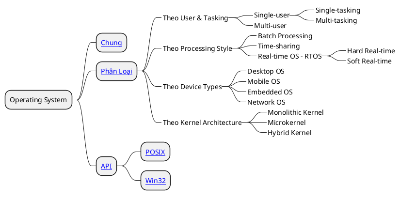

# Operating System

## Operating System

### Tóm Tắt Nội Dung

Cuốn sách {{ book("Operating System", "operating-system") }} viết về **hệ điều hành** và các khái niệm, thuật ngữ xoay quanh hệ điều hành.

- {{ book("Chương 1: Lời Mở Đầu", "operating-system") }}
- {{ book("Chương 2: Phân loại hệ điều hành", "operating-system", "os-types") }}
	- Chương này phân loại hệ điều hành theo các cấu trúc như **User & Tasking**, **Processing Style**, **Device Types** và theo **Kernel Architecture**
- {{ book("Chương 3: File System", "operating-system", "os-file-system") }}
	- Các định dạng tệp như `NTFS`, `FAT32`, `exFAT`, `ext4`, `APFS`
- {{ book("Chương 4: OS API", "operating-system", "os-api") }}
	- Tiêu chuẩn `POSIX` và `WIN32`
- {{ book("Chương 5: POSIX", "operating-system", "os-posix") }}
	- POSIX Signal
	- POSIX SIGKILL
		- `Named Mutex`, `Robust Mutexes`, `Death Lock`
	- POSIX Shell
- {{ book("Chương 6: Win32", "operating-system", "os-win32") }}

### Danh Sách Chương

