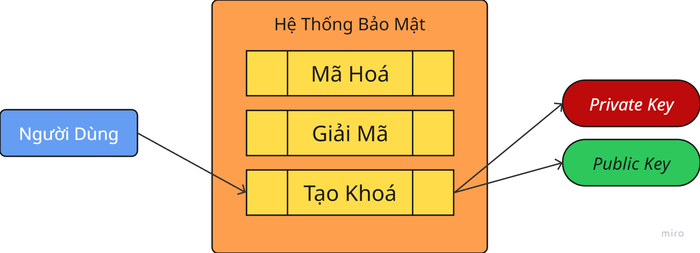

# \[Common\] Chữ Ký Số

## Chữ Ký Số Là Gì?

__Chữ ký số__ là một loại _mật mã khóa công khai_ và thường được sử dụng để phân phối phần mềm, giao dịch tài chính, phần mềm quản lý hợp đồng, và trong các trường hợp khác khi cần phát hiện hành vi làm giả hoặc giả mạo.

__Chữ ký số__ là một cặp khoá bao gồm:

- __*Khóa bí mật (Private Key)*__: Chỉ người ký mới sở hữu và dùng để tạo ra chữ ký số.
- __*Khóa công khai (Public Key)*__: Được công bố rộng rãi và dùng để kiểm tra tính xác thực của chữ ký số.

## Hoạt Động

### Tạo Khoá

- Một hệ thống bảo mật thường sẽ có ba chức năng chính: __*Mã Hoá*__, __*Giải Mã*__, __Tạo Key__
- Người dùng sử dụng bộ tạo __Key__ để lấy được cặp khoá { __*Khóa bí mật*__ & __*Khóa công khai*__ }
- Lúc này:
    - __*Khoá bị mật*__ phải giữ và che giấu không được để người khác biết.
    - __*Khoá công khai*__ có thể chia sẻ, làm chức năng xác thực.

<figure markdown="span">
    
    <figcaption>Tạo Khoá</figcaption>
</figure>

- Để cặp khoá không bị trùng lặp, bộ tạo khoá sẽ sử dụng một thuật toán ngẫu nhiên, có thể thêm vào một số dữ liệu như tên người dùng, thời gian tạo, địa chỉ mail hoặc số điện thoại để cặp khoá trở nên bảo mật hơn.
- Đừng lo lắng, dữ liệu cá nhân chỉ được đưa vào khi người dùng khai báo và sau đó khi đưa qua thuật toán, dữ liệu sẽ bị biến mất và chống phục hồi. Nó chỉ đơn giản làm cho cặp khoá trở nên đáng tin cậy và giảm độ phân tán trong _thuật toán ngẫu nhiên_
- Với cặp khoá đã có, bạn sẽ giữ __*Khoá Cá Nhân (Private Key)*__ lại, còn __*Khoá Công Khai (Public Key)*__ sẽ được chia sẻ cho phía người nhận.

### Tạo Chữ Ký Số

Đầu tiên phía người dùng có một bộ __Dữ Liệu__ cần được mã hoá, cần gửi đi, nhưng phải xác minh được phiên bản gửi đi và phiên bản người bên kia nhận được là toàn vẹn và chưa bị can thiệp, ta có cách vận hành như sau:

<figure markdown="span">
    
    <figcaption>Tạo Chữ Ký Số</figcaption>
</figure>

1. Cơ chế __Mã Hoá__ sẽ sử dụng __Dữ Liệu__ cần mã hoá, __Khoá Bí Mật__, và đôi khi cả __Thời Gian Thực Thi__, địa chỉ __Email__ và __Tên Người Dùng__ để tạo thành một __Chữ Ký Số__
    - _Các thông tin thêm được thêm vào bởi người dùng. Nếu người dùng không muốn, khoá bí mật không cần thiết phải có chúng để hoạt động._
1. Sau đó __Chữ Ký Số__ sẽ được đính kèm cùng __Dữ Liệu__ được gửi đi

### Xác Thực Chữ Ký

<figure markdown="span">
    
    <figcaption></figcaption>
</figure>

1. Đầu tiên ở phía người nhận sẽ sử dụng __*Khoá Công Khai*__ được đính kèm và __*Khoá Công Khai*__ để tạo ra một __Tệp A__.
    - _**Tệp A** còn có thể gọi là Tệp Ký hoặc Tệp Xác Thực A_
1. Tương tự, chạy lại tiến trình _Mã Hoá_ với __*Khoá Công Khai*__ để thu được __*Tệp B (Tệp Xác Thực B)*__
1. So sánh __Tệp A__ với __Tệp B__, nếu:
    - Giống nhau: __*Dữ Liệu Gốc*__ chưa bị chỉnh sửa, có thể tin tưởng được.
    - Khác nhau: __*Dữ Liệu*__ đã bị can thiệp, hoặc chỉnh sửa, không đáng tin cậy.

## Ứng Dụng

### Đảm bảo tính toàn vẹn

Ứng dụng đầu tiên của __Chữ ký số__ là _đảm bảo tính toàn vẹn_.

Nếu ai hiểu rõ ràng về kiến trúc phần mềm, việc _can thiệp sửa đổi_ hoặc _chèn mã độc_ gần như không thể phòng chống. Vậy nên cơ chế này tạo ra để người dùng biết nội dung mình nhận được là an toàn và chưa bị can thiệp. Trong trường hợp phát sinh vấn đề, người dùng nên từ chối thực thi tệp để đảm bảo an toàn.

!!! question "Làm sao Chữ Ký Số đảm bảo dữ liệu an toàn"
    - __Chữ Ký Số__ không bảo vệ dữ liệu, nó dùng để __Xác Thực Dữ Liệu__ chưa bị thay đổi.

!!! question "Sẽ thế nào nếu khoá công khai bị ăn cắp"
    - Không sao cả, bên thứ ba vẫn có quyền sử dụng dữ liệu bị đánh cắp, nhưng người dùng vẫn được đảm bảo.
    - Điều đầu tiên là __*Khoá Công Khai*__ không thể được sử dụng để mã hoá, tức là cho dù có khoá, họ vẫn không thể dùng chúng để làm giả chữ ký.
    - Đồng thời, __*Khoá Công Khai*__ vì là khoá có thể được chia sẻ, việc một dữ liệu được công khai rộng rãi càng tăng tính bảo mật do nhiều người cùng biết. Bên thứ ba rất khó có thể can thiệp vào thông tin công khai này. Nếu khoá bị sửa đổi cực kỳ dễ gây nghi ngờ và các bên sẽ tham gia liên hệ trực tiếp để xác minh đảm bảo nội dung của khoá.

### Xác Thực Danh Tính

Điều thứ 2 là tính __Xác Thực Danh Tính__ của khoá rất mạnh. Vì khả năng tồn tại theo cặp của __*Khóa bí mật*__ và __*Khóa công khai*__ gần như là tồn tại <u>duy nhất trên cùng thời điểm</u>. Rất khó có thể xảy ra trường hợp tồn tại cặp khoá hợp pháp tương tự được tạo bởi một người khác. Điều này dễ dàng được chứng minh bởi tập ánh xạ, tức là một tập người dùng nhỏ A ánh xạ sở hữu khoá đến một tập B vô cùng lớn thì xác suất trùng khoá sẽ gần như bằng không.

Tức là hãy tưởng tượng số lượng người với số hạt cát trên thế giới. Mỗi người sẽ được quyền sở hữu hạt cát dựa trên tên, mail, ... và __*thời gian*__ đăng ký. Qua các thông tin đó sẽ ánh xạ tới một __*vùng nhỏ hơn*__ nhưng hạt cát được chọn vẫn sẽ bị chi phối bởi __*tính ngẫu nhiên*__ được áp dụng lên khu vực đó.

Giả sử có một __*kẻ ngoại lai*__ đến và sử dụng thuật toán để chọn bừa bất kỳ hạt nào đó, việc họ có thể chọn trùng một trong những hạt có người đã đăng ký là gần như không thể.

Điều đó dẫn đến một điều đáng tin cậy. Nếu phần mềm được ký bởi A và sau khi được xác thực thành công bằng Khoá Công Khai của A thì có thể chắc chắn bên A là người sản xuất phần mềm đó. Nghĩa là A không thể _chối bỏ trách nhiệm_ với sản phầm của mình.