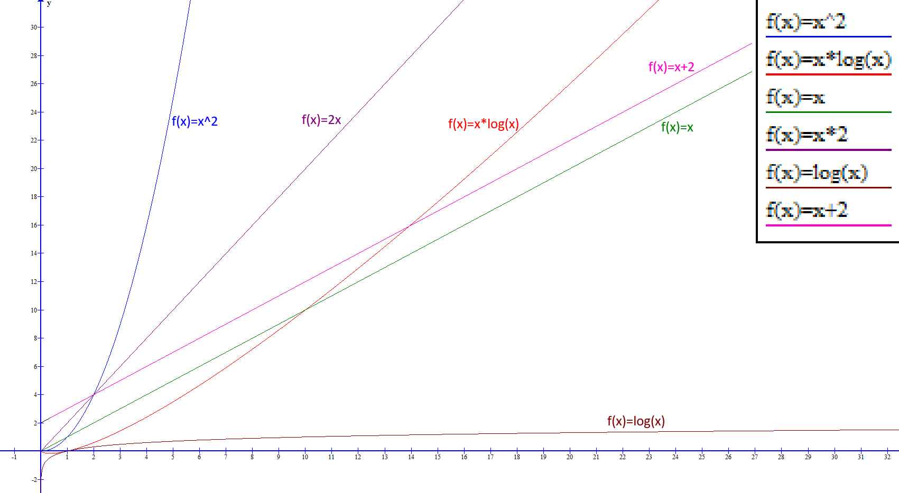

# Độ phức tạp thuật toán

_Độ phức tạp thuật toán_ là thuật ngữ được dùng để mô tả lượng tài nguyên (thời gian và bộ nhớ) mà một thuật toán sử dụng để thực thi, dựa trên kích thước đầu vào của dữ liệu. Nó là một công cụ để đánh giá và so sánh hiệu quả của các thuật toán, thường được biểu diễn bằng ký hiệu [Big O notation](#big-o-notation) để chỉ mối quan hệ tương quan giữa lượng tài nguyên tiêu thụ và kích thước dữ liệu.

Có hai khía cạnh để nói về độ phức tạp của thuật toán là:

- Độ phức tạp về thời gian __*(time complexity)*__: Chỉ sự phức tạp về thời gian.
- Độ phức tạp về không gian bộ nhớ __*(space complexity)*__: Chỉ sự phức tạp về không gian bộ nhớ được sử dụng của người dùng.

## Big O notation

Trong toán học, Big __O notation__ dùng để chỉ hành vi giới hạn của một hàm số khi đối số tiến đến một giá trị nhất định hoặc vô cùng. Trong khoa học máy tính, __Big O notation__ dùng để mô tả hành vi thuật toán (ví dụ, về mặt thời gian tính toán hoặc lượng bộ nhớ cần dùng) khi kích thước dữ liệu thay đổi.

__Big O notation__ mô tả các hàm theo tốc độ tăng của chúng: các hàm khác nhau có cùng tốc độ tăng có thể được mô tả bởi cùng một __Big O notation__. Mô tả hàm bằng __Big O notation__ thường chỉ cung cấp một chặn trên cho tốc độ tăng của hàm. Bên cạnh __Big O notation__ còn có các ký hiệu liên quan khác, sử dụng các ký hiệu o, Ω, ω, và Θ, để mô tả các chặn khác cho tốc độ tăng.

Đánh giá tốc độ thuật toán người ta dựa vào tiêu chí __lấy độ lớn__ là $O$. Phép toán này có nghĩa cực kỳ đơn giản là lấy độ lớn giản lược. Ví dụ trong phép tính $(x+1)$, nếu x tiến đến vô hạn thì 1 không có nghĩa lý gì nên $O(x+1)$ tương đương $O(x)$.

Giản lược với $O(x^4+x^2+x+1)$ thì $x^4$ là lớn nhất thì nó sẽ tương đương với $O(x^4)$. Nghĩa là càng tiến đến vô cùng thì $x^4$ là giá trị lớn nhất và có tầm ảnh hưởng lớn nhất nên nó tương đương với $O(x^4)$.

Giải trong bài thuật toán, $n$ được tính là số trường hợp thì trục còn lại chính là thời gian thực thi. Trong đồ thị dưới này thì trục hoành chính là trục $n$ chỉ số trường hợp và thời gian là trục tung.

Các hàm số thường dùng là $O(n)$, $O(n^2)$, $O(n+k)$, $O(n.log(n))$, ... được biểu thị dưới này. Có thể lấy hai ví dụ đơn giản là hàm số $(x^2)$ và $(x*log(x))$. Mặc dù xuất phát điểm gần tương tự nhau nhưng càng nhiều trường hợp thì $(x^2)$ tưang nhanh hơn nhiều so với $(x*log(x))$.

<figure markdown="span">
    
    <figcaption>Đồ thị tốc độ tăng của một số thuật toán</figcaption>
</figure>