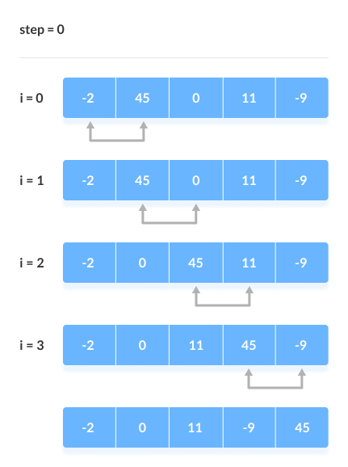

# Bubble Sort

## Mô tả

__Bubble Sort__ là một thuật toán sắp xếp so sánh hai yếu tố liền kề và hoán đổi chúng cho đến khi chúng theo thứ tự dự định.

Giống như chuyển động của các bong bóng không khí trong nước dâng lên trên bề mặt, mỗi phần tử của mảng di chuyển đến cuối trong mỗi lần lặp. Do đó, nó được gọi là một loại bong bóng.

> https://www.programiz.com/dsa/bubble-sort

## Working of Bubble Sort

Giả sử chúng ta đang cố gắng sắp xếp các yếu tố theo thứ tự tăng dần.

1. Lặp lại đầu tiên (so sánh và hoán đổi)
    1. Bắt đầu từ chỉ mục đầu tiên, so sánh các yếu tố thứ nhất và thứ hai.
    1. Nếu phần tử thứ nhất lớn hơn phần tử thứ hai, chúng sẽ được hoán đổi.
    1. Bây giờ, so sánh các yếu tố thứ hai và thứ ba. Trao đổi chúng nếu chúng không theo thứ tự.
    1. Quá trình trên tiếp tục cho đến khi phần tử cuối cùng.

<figure markdown="span">
    
    <figcaption>Mô tả thuật toán bubble sort</figcaption>
</figure>

__Code mẫu:__

=== "C++"
    ```cpp
    int main()
    {
        std::vector<int> v = {11,22,34,5,21,6,9,4,3,1,4,5,65,10};
        bool done = false;
        while(!done) {
            done = true;
            for(int i{0}; i<(v.size()-1); i++) {
                if(v[i] > v[i+1]) {
                    std::swap(v[i], v[i+1]);
                    done = false;
                }
            }
        }
        for(auto x : v) {
            std::cout << x << ' ';
        }
        return 0;
    }
    ```

=== "Java"