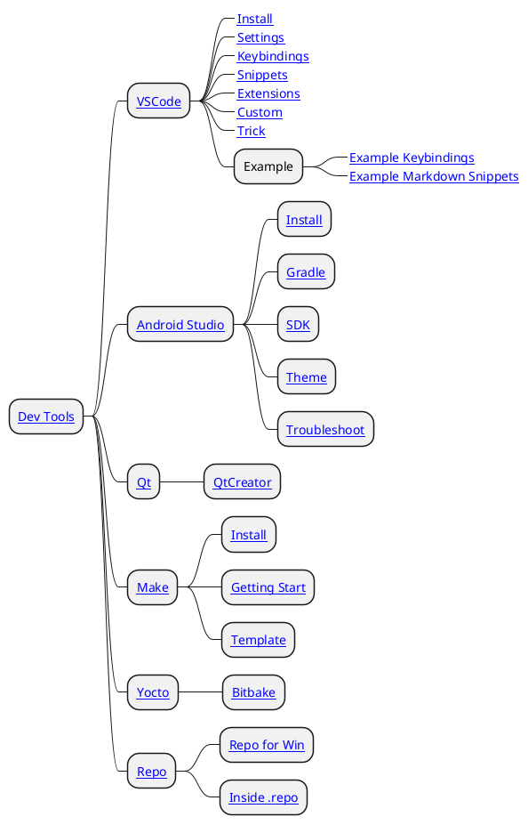

# \[Dev Tools\]

## Map

```puml
@startmindmap
skinparam backgroundcolor transparent
!$URL = "/DevTools"

* [[$URL/dev-tools/ Dev Tools]]
** [[$URL/VSCode/software-vscode/ VSCode]]
***_ [[$URL/VSCode/software-vscode-install/ Install]]
***_ [[$URL/VSCode/software-vscode-settings/ Settings]]
***_ [[$URL/VSCode/software-vscode-keybindings/ Keybindings]]
***_ [[$URL/VSCode/software-vscode-snippets/ Snippets]]
***_ [[$URL/VSCode/software-vscode-extensions/ Extensions]]
***_ [[$URL/VSCode/software-vscode-my-custom/ Custom]]
***_ [[$URL/VSCode/software-vscode-trick/ Trick]]
*** Example
****_ [[$URL/VSCode/example/company-keybindings-json/ Example Keybindings]]
****_ [[$URL/VSCode/example/company-snippets-for-markdown/ Example Markdown Snippets]]
** [[$URL/software-android-studio/ Android Studio]]
*** [[$URL/software-android-studio-install/ Install]]
*** [[$URL/software-android-gradle/ Gradle]]
*** [[$URL/software-android-studio-sdk/ SDK]]
*** [[$URL/software-android-studio-theme/ Theme]]
*** [[$URL/software-android-studio-troubleshoot/ Troubleshoot]]
** [[$URL/Qt/qt/ Qt]]
*** [[$URL/Qt/qt-software-qt-creator/ QtCreator]]
** [[$URL/Make/make/ Make]]
*** [[$URL/Make/make-install/ Install]]
*** [[$URL/Make/make-getting-start/ Getting Start]]
*** [[$URL/Make/make-template/ Template]]
** [[$URL/Yocto/yocto/ Yocto]]
*** [[$URL/Yocto/yocto-bitbake/ Bitbake]]
** [[$URL/Repo/repo/ Repo]]
*** [[$URL/Repo/repo-windows/ Repo for Win]]
*** [[$URL/Repo/repo-repo-inside/ Inside .repo]]
@endmindmap
```