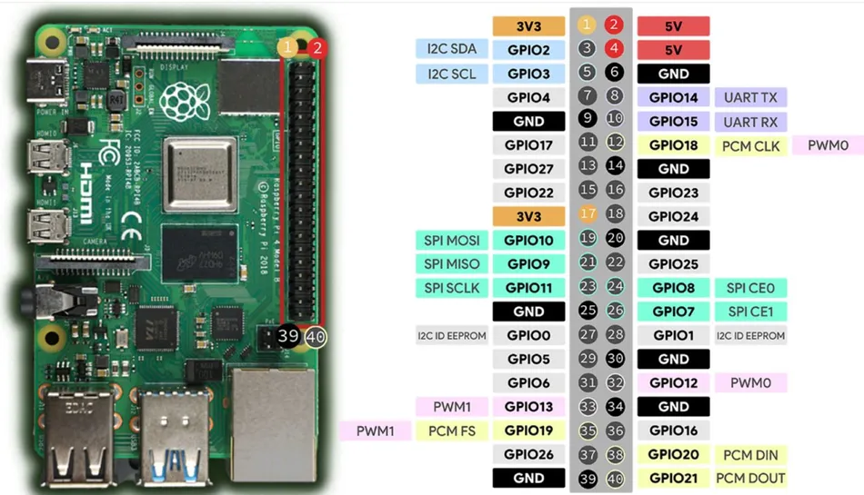

# Raspberry Pi

## Overview

## PinOut

=== "RPi 4 Pinout"
    <figure markdown="span">
        
        <figcaption></figcaption>
    </figure>

    _Khi đấu nối qua USB to TTL, đấu ngược TX với RX, RX với TX._
=== "RPi 5 Pinout"

    _Chưa có tiền mua._

## Software

### Raspberry Pi Imager

Xem phiên bản tải về ở [https://www.raspberrypi.com/software/](https://www.raspberrypi.com/software/)

Phiên bản dành cho các hệ điều hành:

=== "Windows"
    - [Download](https://downloads.raspberrypi.com/imager/imager_latest.exe)
=== "macOS"
    - [Download](https://downloads.raspberrypi.com/imager/imager_latest.dmg)
=== "Linux"
    - [Download](https://downloads.raspberrypi.com/imager/imager_latest_amd64.AppImage)
=== "Raspberry Pi OS"
    Sử dụng trực tiếp lệnh sau trên _terminal_:

    ```bash
    sudo apt install rpi-imager
    ```

### Raspberry Pi Connect
