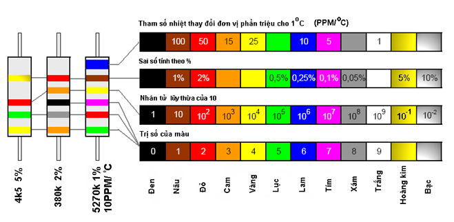

# \[Electronic\] Linh Kiện Điện Tử

## Định Nghĩa

Điện trở là một linh kiện điện tử thụ động gồm 2 tiếp điểm kết nối, thường được dùng để hạn chế cường độ dòng điện

## Ký hiệu và quy ước

<figure markdown="span">
    
    <figcaption>Ký hiệu điện trở kiểu Mỹ. (a) Điện trở thường, (b) Biến trở, (c) Chiết áp
</figcaption>
</figure>

<figure markdown="span">
    
    <figcaption>Ký hiệu điện trở theo kiểu (IEC)</figcaption>
</figure>

## Mã màu trên điện trở

Trong thực tế, để đọc được giá trị của một điện trở thì ngoài việc nhà sản xuất in trị số của nó lên linh kiện thì người ta còn dùng một qui ước chung để đọc trị số điện trở và các tham số cần thiết khác. Giá trị được tính ra thành đơn vị Ohm (sau đó có thể viết lại thành $k$ hay $M$ cho tiện)

<figure markdown="span">
    
    <figcaption></figcaption>
</figure>

Trong hình:

- Điện trở ở vị trí bên trái có giá trị được tính như sau: $R = 45 × 102 \Omega = 4,5 K\Omega$
- Bởi vì vàng tương ứng với $4$, xanh lục tương ứng với $5$, và đỏ tương ứng với giá trị số mũ $2$. Vòng màu cuối cho biết sai số của điện trở có thể trong phạm vi $5%$ ứng với màu kim loại vàng.
- Điện trở ở vị trí giữa có giá trị được tính như sau: $R = 380 × 103 \Omega = 380 K\Omega$
- Bởi vì cam tương ứng với $3$, xám tương ứng với $8$, đen tương ứng với $0$, và cam tương ứng với giá trị số mũ $3$. Vòng cuối cho biết giá trị sai số là $2%$ ứng với màu đỏ.
- Điện trở ở vị trí bên phải có giá trị được tính như sau: $R = 527 × 104 Ω = 5270 KΩ$
- Bởi vì xanh lục tương ứng với $5$, đỏ tương ứng với $2$, và tím tương ứng với $7$, vàng tương ứng với số mũ $4$, và nâu tương ứng với sai số $1%$. Vòng màu cuối cho biết sự thay đổi giá trị của điện trở theo nhiệt độ là $10 PPM/°C$.