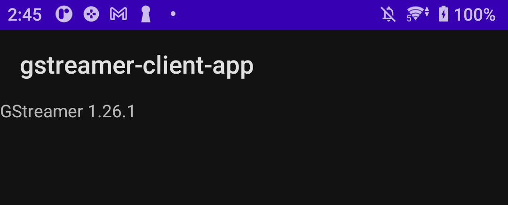

# Android GStreamer Application 0

Trong phần xây dựng ứng dụng đầu tiên này tôi sẽ trình bày hướng để dựng một ứng dụng kèm với thư viện __*GStreamer*__ thông qua __*Android Studio*__.

Phần đặc biệt của ứng dụng này sẽ là sử dụng trực tiếp Android Studio để dựng ra thư viện `libgstreamer_android.so` và sử dụng. Tốt nhất là không nên làm thế nữa thì mình sẽ dựng được ứng dụng bằng con laptop ghẻ của mình!

## Tạo Ứng Dụng Mẫu

Ở bước này sẽ tạo một ứng dụng mẫu chỉ cần có một __TextView__ là được rồi. Xem hướng dẫn ở [First Application](../../Developer/Android/android-dev-first-application.md) để xem cách dựng một ứng dụng mẫu.

Nhưng ở đây mình sẽ dùng Kotlin để code, cũng tương tự thôi!

Ví dụ về ứng dụng có thể tham khảo ở đây: [https://github.com/dothanhdathp/gstreamer-application](https://github.com/dothanhdathp/gstreamer-application)


## Thư viện

- Mục tiêu là sẽ có thư viện `libgstreamer_android.so`
- Phiên bản `1.26.1` được chọn làm mẫu _(Bản khác tuỳ các bạn)_
- Ở bản `1.26.1` quay lại chương trước, [Dựng thư viện](gstreamer-android-build-gstreamer.md), tìm thấy __NDK Version__ được khuyến nghị là `r25c`.

### Tải thư viện

- Vào đường dẫn ở đây cho cho [Android Universal (1.26.1)](https://gstreamer.freedesktop.org/data/pkg/android/1.26.1/).
- Thấy cái tệp `gstreamer-1.0-android-universal-1.26.1.tar.xz` chưa? Tải nó về:
    ```bash
    wget https://gstreamer.freedesktop.org/data/pkg/android/1.26.1/gstreamer-1.0-android-universal-1.26.1.tar.xz
    ```
- Vì để giải nén trên Windows sẽ lỗi, nên tải về trên máy __Ubuntu__
- Tải xong thì giải nén
    ```bash
    tar -xf gstreamer-1.0-android-universal-1.26.1.tar.xz
    ```
- Trong thư mục `gstreamer-1.0-android-universal-1.26.1` sẽ có các tệp sau:
    ```text
    .
    ├── arm64
    ├── armv7
    ├── x86
    └── x86_64
    ```

Sau đó thì sao lưu lại về máy và để trong `gstreamer-application`, cạnh ứng dụng `client-gstreamer-application` được xây dựng ở trên.

### Phần thư viện

Trước hết cần phải xác định đường dẫn chính xác của thư mục `gstreamer-1.0-android-universal-1.26.1`. Giả sử là `D:\Project\Android\gstreamer-1.0-android-universal-1.26.1` thì:

#### gradle.properties

Khai báo đường dẫn trong tệp `gradle.properties`:

```bash
gstAndroidRoot=D\:\\Project\\Android\\gstreamer-1.0-android-universal-1.26.1
```

#### build.gradle.kts

Đường dẫn này sẽ là tiêu chuẩn cho bước tiếp theo vào `build.gradle.kts` và bắt đầu khai báo việc dựng ứng dụng. Thêm cờ này vào trong mục `defaultConfig`:

```txt title="build.gradle.kts"
defaultConfig {
    externalNativeBuild {
        ndkBuild {
            val gstRoot: String? = if (project.hasProperty("gstAndroidRoot")) {
                project.property("gstAndroidRoot") as String
            } else {
                System.getenv("GSTREAMER_ROOT_ANDROID")
            }

            if (gstRoot == null) {
                throw GradleException(
                    "GSTREAMER_ROOT_ANDROID must be set, or 'gstAndroidRoot' must be defined in your gradle.properties in the top level directory of the unpacked universal GStreamer Android binaries"
                )
            }

            arguments.addAll(
                listOf(
                    "NDK_APPLICATION_MK=jni/Application.mk",
                    "GSTREAMER_JAVA_SRC_DIR=src/main/java",
                    "GSTREAMER_ROOT_ANDROID=$gstRoot",
                    "GSTREAMER_ASSETS_DIR=src/main/assets"
                )
            )

            targets.addAll(
                listOf(
                    "jgstreamer"
                )
            )

            abiFilters.addAll(listOf("arm64-v8a"))
        }
    }
}
```

Và đương nhiên phải thêm cái này để dụng __JNI__:

#### Android.mk trong jni

Trong thư mục của __JNI__ thì khai báo __Android.mk__ như này:

```bash
(jni)
├── Android.mk
├── Application.mk
└── gstreamer.c
```

```mk title="Android.mk"
LOCAL_PATH := $(call my-dir)

# --- Module for Sender---
include $(CLEAR_VARS)
LOCAL_MODULE    := jgstreamer
LOCAL_SRC_FILES := gstreamer.c
LOCAL_SHARED_LIBRARIES := gstreamer_android
LOCAL_LDLIBS := -llog -landroid
include $(BUILD_SHARED_LIBRARY)

GSTREAMER_ROOT_ANDROID :=D:/Project/Android/gstreamer-1.0-android-universal-1.26.1

ifndef GSTREAMER_ROOT_ANDROID
$(error GSTREAMER_ROOT_ANDROID is not defined!)
endif

ifeq ($(TARGET_ARCH_ABI),armeabi)
GSTREAMER_ROOT        := $(GSTREAMER_ROOT_ANDROID)/arm
else ifeq ($(TARGET_ARCH_ABI),armeabi-v7a)
GSTREAMER_ROOT        := $(GSTREAMER_ROOT_ANDROID)/armv7
else ifeq ($(TARGET_ARCH_ABI),arm64-v8a)
GSTREAMER_ROOT        := $(GSTREAMER_ROOT_ANDROID)/arm64
else ifeq ($(TARGET_ARCH_ABI),x86)
GSTREAMER_ROOT        := $(GSTREAMER_ROOT_ANDROID)/x86
else ifeq ($(TARGET_ARCH_ABI),x86_64)
GSTREAMER_ROOT        := $(GSTREAMER_ROOT_ANDROID)/x86_64
else
$(error Target arch ABI not supported: $(TARGET_ARCH_ABI))
endif

GSTREAMER_NDK_BUILD_PATH  := $(GSTREAMER_ROOT)/share/gst-android/ndk-build/
include $(GSTREAMER_NDK_BUILD_PATH)/plugins.mk
GSTREAMER_EXTRA_LIBS      := -liconv
GSTREAMER_PLUGINS         := $(GSTREAMER_PLUGINS_CORE) $(GSTREAMER_PLUGINS_PLAYBACK) $(GSTREAMER_PLUGINS_SYS) $(GSTREAMER_PLUGINS_CODECS) $(GSTREAMER_PLUGINS_CODECS_RESTRICTED) $(GSTREAMER_PLUGINS_NET)
G_IO_MODULES              := openssl
GSTREAMER_EXTRA_DEPS      := gstreamer-video-1.0 glib-2.0 gstreamer-app-1.0
include $(GSTREAMER_NDK_BUILD_PATH)/gstreamer-1.0.mk
```

Chú ý đến đường dẫn `GSTREAMER_ROOT_ANDROID` sẽ được cài đặt theo đường dẫn đến thư mục chứa `gstreamer-1.0-android-universal-1.26.1`, nên giá trị ở đây là: `D:/Project/Android/gstreamer-1.0-android-universal-1.26.1`

### Phần ứng dụng

Trong ứng dụng đầu tiên cần khai báo dựng cho __JNI__ để gọi được đến __C/C++__

```txt title="build.gradle.kts"
externalNativeBuild {
    ndkBuild {
        path = file("jni/Android.mk")
    }
}
```

#### gstreamer.c

Dùng `gstreamer.c` làm cầu nối giữa thư viện __*gstreamer_android*__ và ứng dụng, khai báo thế này:

```c title="gstreamer.c"
#include <string.h>
#include <jni.h>
#include <android/log.h>
#include <gst/gst.h>

/*
 * Java Bindings
 */
static jstring gst_native_get_gstreamer_info (JNIEnv * env, jobject thiz)
{
    char *version_utf8 = gst_version_string ();
    jstring *version_jstring = (*env)->NewStringUTF (env, version_utf8);
    g_free (version_utf8);
    return version_jstring;
}

// Gán JNI export method
static JNINativeMethod native_methods[] = {
        {"nativeGetGStreamerInfo", "()Ljava/lang/String;", (void *) gst_native_get_gstreamer_info}
};

jint JNI_OnLoad (JavaVM *vm, void *reserved) {
    JNIEnv *env = NULL;

    if ((*vm)->GetEnv (vm, (void **) &env, JNI_VERSION_1_4) != JNI_OK) {
        __android_log_print (ANDROID_LOG_ERROR, "jgstreamer", "Could not retrieve JNIEnv");
        return 0;
    }

    jclass klass = (*env)->FindClass (env, "com/example/gstreamer_client_app/MainActivity");
    (*env)->RegisterNatives (env, klass, native_methods, G_N_ELEMENTS (native_methods));

    return JNI_VERSION_1_4;
}
```

#### MainActivity.kt

Ở phía ứng dụng viết mã thế này:

```java title="MainActivity.kt"
class MainActivity : AppCompatActivity() {
    // Khai báo cho hàm cục bộ
    private external fun nativeGetGStreamerInfo() : String

    // Tải thư viện
    companion object {
        init {
            System.loadLibrary("gstreamer_android")
            System.loadLibrary("jgstreamer")
        }
    }

    override fun onCreate(savedInstanceState: Bundle?) {
        super.onCreate(savedInstanceState)
        setContentView(R.layout.activity_main)

        var text_view = findViewById<TextView>(R.id.text_view)
        // In ra số hiện phiên bản của GStreamer
        text_view.setText(nativeGetGStreamerInfo())
    }
}
```

- `gstreamer_android` sẽ tải lên thư viện `libgstreamer_android.so` nằm trong thư mục `gst-android-build`.
- `jgstreamer` là thư viện được tạo ra bởi __JNI__. Nó là dòng `LOCAL_MODULE    := jgstreamer` trong tệp  __*Android.mk*__ _(Xem lại [Android.mk of jni](#androidmk-trong-jni))_

## Kết quả

<figure markdown="span">
    
    <figcaption></figcaption>
</figure>