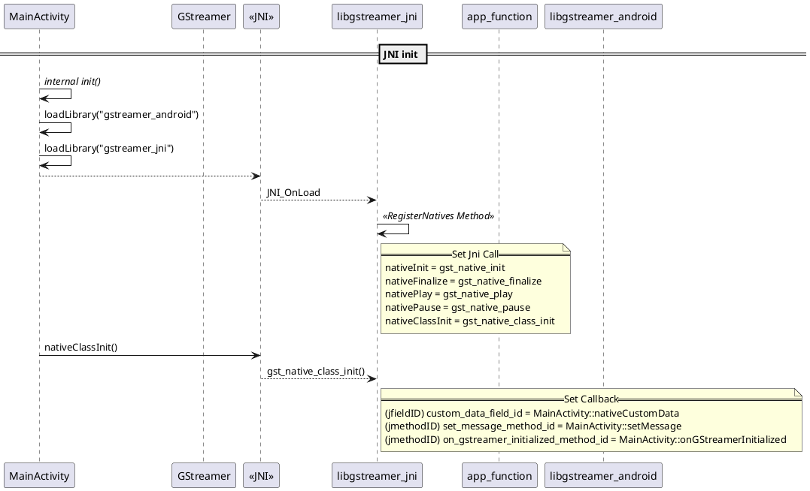
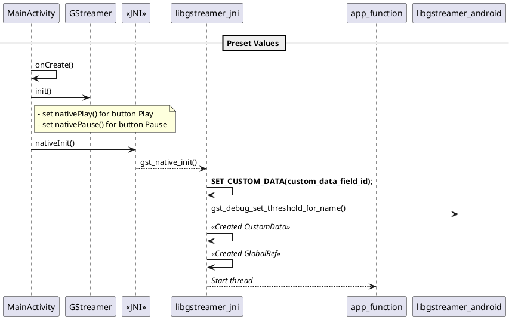
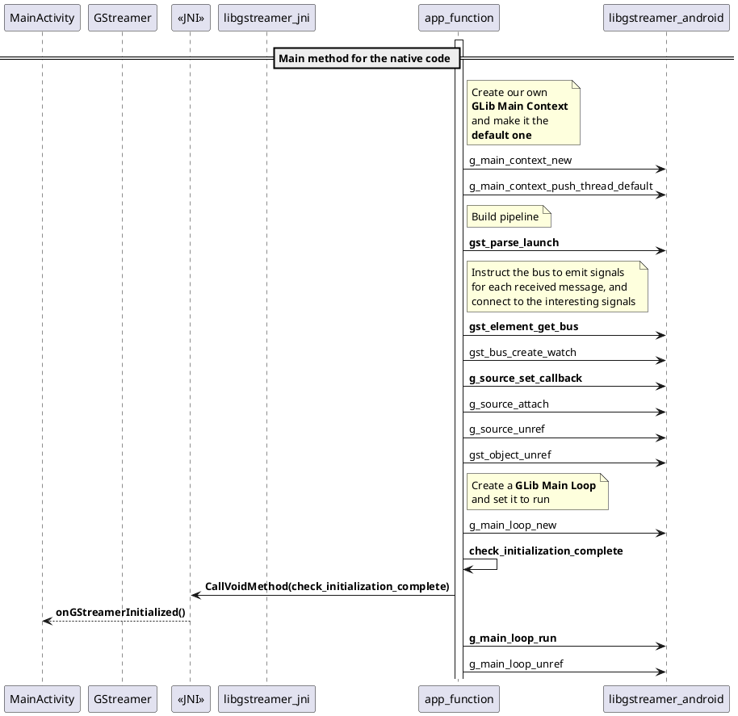
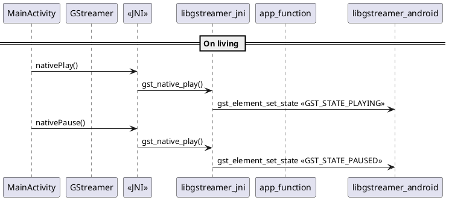
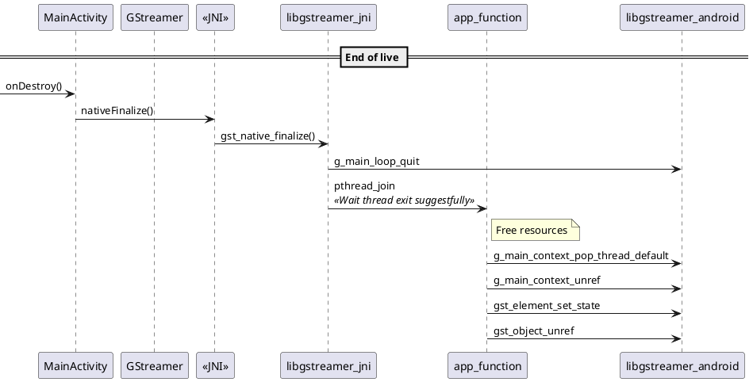

# GStreamer Android Tutorial 2

## Preset

### JNI init

#### JNI_OnLoad

__JNI_OnLoad()__ là hàm sẽ được gọi ngay sau khi __*loadLibrary("gstreamer_jni")*__. Trong hàm này sẽ có các chức năng:

### Preset Value

## Thread app_function

### Main method for the native code

### On living

### End of live

## Warning

!!! danger "CustomData should be size long?"
    - Trong mô tả có nói về yêu cầu thành phần này phải có độ dài tương đương một giá trị `long`, vậy điều đó có nhất định hay không?
    - Và JNI nó có hoạt động giống với thằng C thuần thông thường hay không?
    - Tại sao lại không dùng C++ nhỉ?