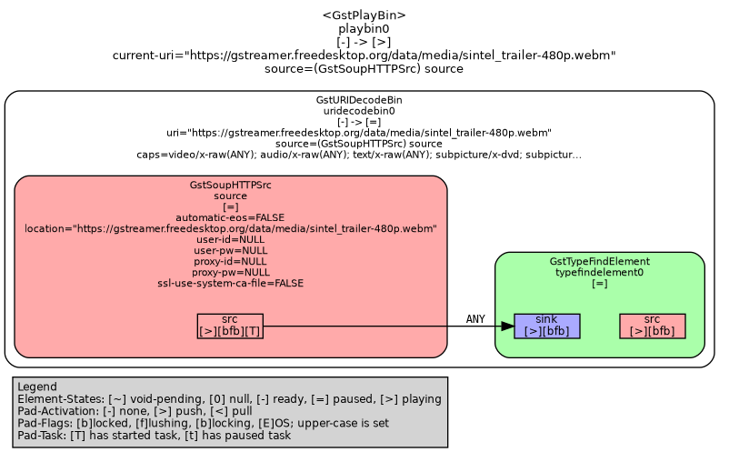
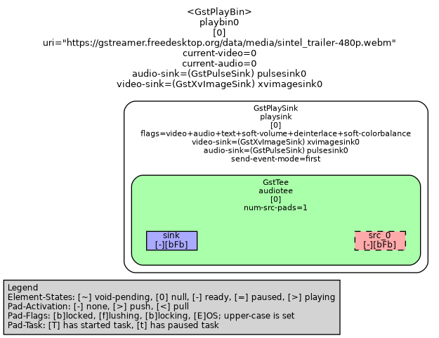

# Pipeline Graphs in Code

## Mục tiêu

!!! note "Note"
    GStreamer có chức năng tạo ra các tệp `.dot` để vẽ ra đồ thị của các đường ống lúc hoạt động. Chức năng đó được mô tả trong chương [Graphs](gstreamer-pipeline-graphs.md).

    Ở bài viết này ta sẽ tham khảo cách thêm mã để xem xét làm thế nào các tệp đó được tạo ra.

## Chức năng


Trong hướng dẫn có nói đến:

> - To aid debugging applications one can use this method to write out the whole network of gstreamer elements that form the pipeline into a dot file. This file can be processed with graphviz to get an image, like this:
> - __*Dịch:*__ Để hỗ trợ các ứng dụng gỡ lỗi, người ta có thể sử dụng phương pháp này để viết ra toàn bộ mạng lưới các phần tử __GSTreamer__ tạo thành đường ống vào một tệp DOT. Tệp này có thể được xử lý với GraphViz để có được một hình ảnh, như thế này:

Và hàm đó được mô tả như thế này:

```c
#define GST_DEBUG_BIN_TO_DOT_FILE(bin, details, file_name) gst_debug_bin_to_dot_file (bin, details, file_name)
```

__*Marco*__ đó gọi đến hàm __*gst_debug_bin_to_dot_file()*__

```c
void 
gst_debug_bin_to_dot_file (GstBin * bin,
                           GstDebugGraphDetails details,
                           const gchar * file_name)

```

- `bin` – __*top-level*__ của đường ống cần được phân tích
- `details` – loại của __GstDebugGraphDetails__để sử dụng
- `file_name` ( [typefilename]) – Tên tệp cơ sở đầu ra (e.g. "myplayer")

## Thực hiện

### Bước 1 - Code

Sử dụng code mẫu dựa trên mẫu của page [Hello World _(gstreamer)_](gstreamer-b-hello-world.md), và thêm các dòng lệnh để tạo `.dot file` như code dưới đây.

[Xem code mẫu](ext/gstreamer-b-pipeline-graphs-main.md)

### Bước 2 - Thêm biến môi trường

Cài đặt biến môi trường như dưới đây

```bash
export GST_DEBUG_DUMP_DOT_DIR=/tmp
```

Tệp `/tmp` là ví dụ, có thể thay đổi đường dẫn sang một đường dẫn khác.

Đường dẫn đó là nơi mà các tệp `.dot` sẽ được lưu ra.

### Bước 3 - Chạy

Dựng lại chương trình và chạy.

```bash
gcc main.c -o main `pkg-config --cflags --libs gstreamer-1.0`
./main
```

### Bước 4 - Tạo tệp đồ thị

Điều hướng và trong tệp `/tmp`:

```bash
cd /tmp
```

Tạo hình ảnh đồ thị:

```txt
dot -Tpng MAIN_STATE_PLAYING.dot > playing.png
dot -Tpng MAIN_STATE_NULL.dot > null.png
```

### Kết quả

<figure markdown="span">
    
    <figcaption>playing.png</figcaptio>
</figure>

<figure markdown="span">
    
    <figcaption>null.png</figcaption>
</figure>

## Phân tích

- Dòng lệnh thực hiện việc tạo tệp `.dot` là __*gst_debug_bin_to_dot_file()*__

```c
    /* Generate DOT file for visualization */
    gst_debug_bin_to_dot_file((GstBin*)pipeline, GST_DEBUG_GRAPH_SHOW_ALL, "MAIN_STATE_PLAYING");
```

- Và các `pipeline` sẽ khác nhau sau mỗi __STATE__ _(Nên đặt các dòng lệnh tạo sau mỗi STATE)_

- __GST_STATE_PLAYING__
    ```c
        /* Start playing */
        gst_element_set_state(pipeline, GST_STATE_PLAYING);

        /* Generate DOT file for visualization */
        gst_debug_bin_to_dot_file((GstBin*)pipeline, GST_DEBUG_GRAPH_SHOW_ALL, "MAIN_STATE_PLAYING");
    ```
- __MAIN_STATE_NULL__
    ```c
        gst_element_set_state(pipeline, GST_STATE_NULL);
        /* Generate DOT file for visualization */
        gst_debug_bin_to_dot_file((GstBin*)pipeline, GST_DEBUG_GRAPH_SHOW_ALL, "MAIN_STATE_NULL");
    ```

Trong hàm __*gst_debug_bin_to_dot_file()*__, đối số đầu tiên yêu cầu đầu vào là `GstBin*` và nó là __*pipeline*__. Điều này thỏa mãn vì pipeline là một dạng của `GstElement*` _(kế thừa)_.

`GST_DEBUG_GRAPH_SHOW_ALL` là dạng __*enum*__, tài liệu ở [GstDebugGraphDetails](https://gstreamer.freedesktop.org/documentation/gstreamer/debugutils.html?gi-language=c#GstDebugGraphDetails). Các đối số khác là:

- `GST_DEBUG_GRAPH_SHOW_MEDIA_TYPE (1)` – Hiển thị tên Caps trên các cạnh
- `GST_DEBUG_GRAPH_SHOW_CAPS_DETAILS (2)` – Hiển thị Caps-Details trên các cạnh
- `GST_DEBUG_GRAPH_SHOW_NON_DEFAULT_PARAMS (4)` – Hiển thị các tham số được sửa đổi trên các phần tử
- `GST_DEBUG_GRAPH_SHOW_STATES (8)` – Hiển thị trạng thái yếu tố
- `GST_DEBUG_GRAPH_SHOW_FULL_PARAMS (16)` – hiển thị các giá trị tham số phần tử đầy đủ ngay cả khi chúng rất dài
- `GST_DEBUG_GRAPH_SHOW_ALL (15)` – Hiển thị tất cả các chi tiết điển hình mà người ta có thể muốn
- `GST_DEBUG_GRAPH_SHOW_VERBOSE (4294967295)` – Hiển thị tất cả các chi tiết bất kể chúng tạo ra đầu ra lớn hay dài dòng như thế nào

Đầu vào cuối cùng là dạng chuỗi _(`"MAIN_STATE_PLAYING"`, `"MAIN_STATE_PLAYING"`)_, nó định nghĩa cho tên tệp và tùy ý lựa chọn. Vì ở đây mình đã đặt tên là `"MAIN_STATE_PLAYING"`, `"MAIN_STATE_PLAYING"` nên các tệp đầu ra tương ứng sẽ là `"MAIN_STATE_PLAYING.dot"`, `"MAIN_STATE_PLAYING.dot"`