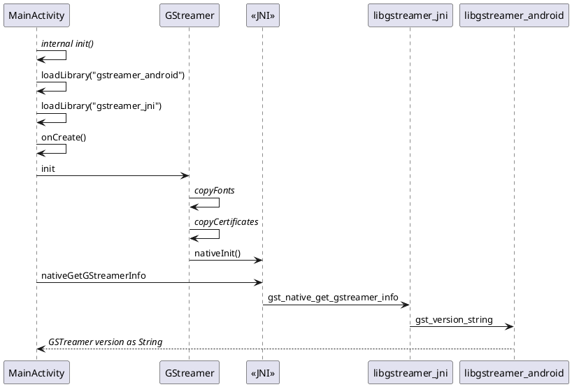

# GStreamer Android Tutorial 1

## Mục đích

- Sử dụng thư viện của __*gstream*__ để hiển thị ra số hiệu phiên bản được sử dụng.

## Github

Năm trong dự án [_gstreamer-kotlin-example_](https://github.com/dothanhdathp/gstreamer-android-example) trên nhánh [_gstreamer-kotlin-example-1_](https://github.com/dothanhdathp/gstreamer-android-example/tree/gstreamer-kotlin-example-1)

```text
git clone git@github.com:dothanhdathp/gstreamer-android-example.git -b gstreamer-kotlin-example-1
```

## Gstreamer Binary

### Gstreamer Binary cho Android

Đầu tiên cần tải về tệp binary của gstreamer và giải nén nó. Ở đây là ví dụ nên mình sẽ dùng phiên bản mới nhất, ổn định nhất được biết đến ở thời điểm viết bài này là `gstreamer-1.0-android-universal-1.26.1`

Tải về tệp binary của gstreamer

=== "Wget"
    ```bash
    wget https://gstreamer.freedesktop.org/data/pkg/android/1.26.1/gstreamer-1.0-android-universal-1.26.1.tar.xz
    ```
=== "Curl"
    ```bash
    curl -O https://gstreamer.freedesktop.org/data/pkg/android/1.26.1/gstreamer-1.0-android-universal-1.26.1.tar.xz
    ```

Sau đó giải nén:

```text
tar -xf gstreamer-1.0-android-universal-1.26.1.tar.xz gstreamer-1.0-android-universal-1.26.1
```

Trong thư mục __gstreamer-1.0-android-universal-1.26.1__ thường sẽ có ba thư mục con là `arm64`, `armv7`, `x86` và `x86_64`. Từ giờ có thể sao chép thư mục này sang __Windows__ để sử dụng.

### Source Code

Tải về mã nguồn trong phần [Github](#github).

### Config Build

#### Chọn NDK

Đầu tiên sẽ là phần chỉnh sửa và cấu hình lại để có thể phù hợp với chương trình.

Trên trang chủ của __*GStreamer*__, phiên bản __*NDK*__ được khuyển nghị là __r25c__, để tải NDK dùng:
- __Tool__ -> Chọn __SDK Manager__
- Chọn thẻ __Android SDK__
- Trong khung bên phải chọn thẻ __SDK Tools__, bật lựa chọn __Show Package Details__ ở dưới.
- Kéo xuống tìm khu vực của NDK, chọn phiên bản phù hợp, ví dụ `25.2.9519653` hoặc `25.1.8937393`, ...

#### Cài đặt đường dẫn cho Gstreamer binaries

Trong tệp __*gradle.properties*__, sửa biến môi trường __gstAndroidRoot__ vào đúng địa chỉ thư mục nơi chứa binary của __*gstreamer*__, ví dụ:

```text title="gradle.properties"
gstAndroidRoot=D:\\Work\\gstreamer-1.0-android-universal-1.26.5
```

Sửa tương tự trong tệp __*app/jni/Android.mk*__

```text
GSTREAMER_ROOT_ANDROID := D:/Work/gstreamer-1.0-android-universal-1.26.5
```

## Build

!!! note "Build"
    Sau khi cài đặt xong mọi thứ chỉ cần bấm nút để bắt đầu dựng chương trình. Nếu không có gì thay đổi thì sẽ dựng thành công.

## Phân tích chương trình

### Tài nguyên bắt buộc

#### GStreamer

Class __GStreamer__ phải có và package của nó phải là __*package org.freedesktop.gstreamer*__

#### Assets

Class __GStreamer__ sẽ cần sao chép một số tài nguyên cần có để hỗ trợ như là __*font*__ và __*certs*__. Và chúng cần để đúng ở đường dẫn `src/assets` _(ngang hàng với main)_


### Application

- Ở tầng ứng dụng cần khai báo một số hàm liên kết với tầng JNI. Ở đây là hàm __*nativeGetGStreamerInfo*__.
- Nội dung của __*nativeGetGStreamerInfo*__ sẽ được viết ở dưới JNI _(ngôn ngữ C)_

```kotlin
private external fun nativeGetGStreamerInfo(): String
```

### Hoạt động

