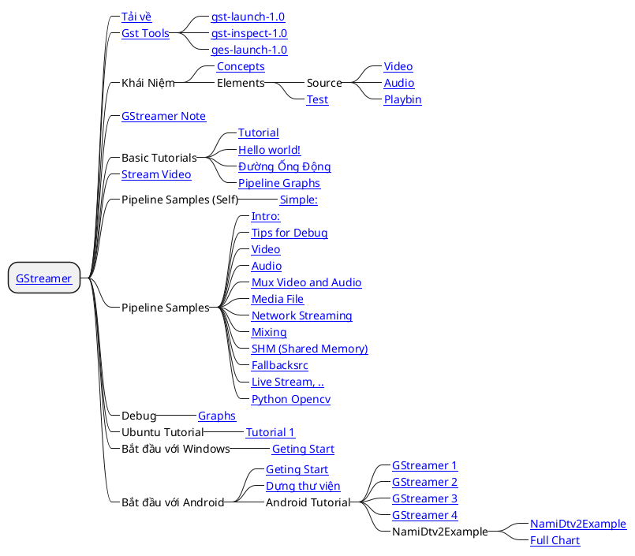

# \[GStreamer\] About

## Chung

- __GStreamer__ là một <u>__*framework*__ để tạo ra các ứng dụng truyền phát đa phương tiện</u>. Các ứng dụng mà nó hỗ trợ trải dài từ __Player__ _(phát lại)_ Ogg/Vorbis đơn giản, phát trực tuyến âm thanh/video đến xử lý âm thanh (mixing) và video (biên tập phi tuyến tính) phức tạp.
- Các ứng dụng có thể tận dụng những tiến bộ trong công nghệ codec và bộ lọc một cách minh bạch. Các nhà phát triển có thể thêm codec và bộ lọc mới bằng cách viết một plugin đơn giản với giao diện gọn gàng, ...
- __GStreamer__ được phát hành theo giấy phép LGPL. Phiên bản 1.x ổn định với API và ABI, thay thế cho phiên bản ổn định trước đó là 0.10. Cả hai đều có thể được cài đặt song song.

## Các Chủ Đề



## Tham khảo

- Trang chủ: [https://gstreamer.freedesktop.org/](https://gstreamer.freedesktop.org/)
- Tài liệu API: [https://gstreamer.freedesktop.org/documentation/index.html](https://gstreamer.freedesktop.org/documentation/index.html)

## Ghi chú hôm nay

Có vẻ __*streaming*__ thông qua TCP có hiệu quả cao hơn hẳn so với udp. Đặc điểm là _ít lag_ và _không vỡ hình_.

```bash title="Server"
gst-launch-1.0 videotestsrc ! videoconvert ! x264enc tune=zerolatency ! "video/x-h264,stream-format=byte-stream" ! tcpserversink host=0.0.0.0 port=8000
```
```bash title="Clients"
gst-launch-1.0 tcpclientsrc host=192.168.100.184 port=8000 ! h264parse ! avdec_h264 ! autovideosink
```