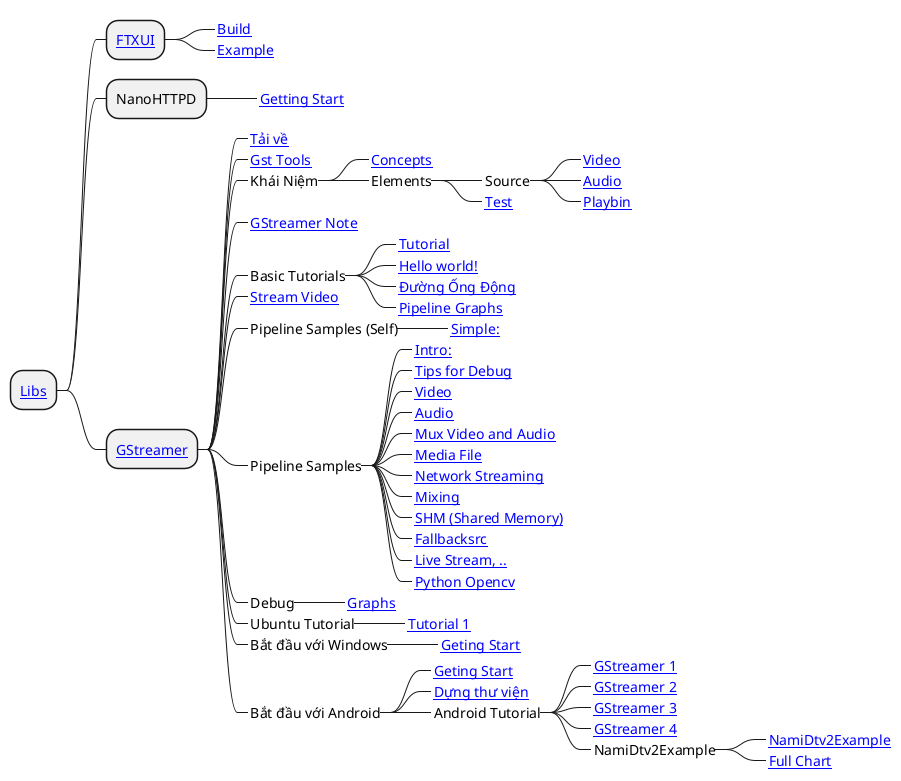

# Lib

Tổng hợp các thư viện thuộc về dự án mã nguồn mở `open-source`, nghiên cứu và chỉnh sửa chúng.

```puml
@startmindmap
skinparam backgroundcolor transparent
!$URL = "/Libs"

* [[$URL/libs Libs]]
** [[$URL/FTXUI/ftxui FTXUI]]
***_ [[$URL/FTXUI/ftxui-build Build]]
***_ [[$URL/FTXUI/ftxui-example Example]]
** NanoHTTPD
***_ [[$URL/NanoHTTPD/lib-nanohttpd Getting Start]]
** [[$URL/GStreamer/gstreamer GStreamer]]
***_ [[$URL/GStreamer/gstreamer-installing Tải về]]
***_ [[$URL/GStreamer/gstreamer-tools Gst Tools]]
***_ Khái Niệm
****_ [[$URL/GStreamer/gstreamer-gstreamer-concepts Concepts]]
****_ Elements
*****_ Source
******_ [[$URL/GStreamer/gstreamer-element-video-source Video]]
******_ [[$URL/GStreamer/gstreamer-tools-stream-video Audio]]
******_ [[$URL/GStreamer/gstreamer-tools-stream-video Playbin]]
*****_ [[$URL/GStreamer/gstreamer-tools-stream-video Test]]
***_ [[$URL/GStreamer/gstreamer-notebook GStreamer Note]]
***_ Basic Tutorials
****_ [[$URL/GStreamer/gstreamer-b-tutorial Tutorial]]
****_ [[$URL/GStreamer/gstreamer-b-hello-world Hello world!]]
****_ [[$URL/GStreamer/gstreamer-b-dynamic-pipelines Đường Ống Động]]
****_ [[$URL/GStreamer/gstreamer-b-pipeline-graphs Pipeline Graphs]]
***_ [[$URL/GStreamer/gstreamer-tools-stream-video Stream Video]]
***_ Pipeline Samples (Self)
****_ [[$URL/GStreamer/gstreamer-pipeline-samples-simple Simple:]]
***_ Pipeline Samples
****_ [[$URL/GStreamer/gstreamer-pipeline-samples Intro:]]
****_ [[$URL/GStreamer/gstreamer-pipeline-samples-tips-for-debug Tips for Debug]]
****_ [[$URL/GStreamer/gstreamer-pipeline-samples-video Video]]
****_ [[$URL/GStreamer/gstreamer-pipeline-samples-audio Audio]]
****_ [[$URL/GStreamer/gstreamer-pipeline-samples-mux-video-and-audio Mux Video and Audio]]
****_ [[$URL/GStreamer/gstreamer-pipeline-samples-media-file Media File]]
****_ [[$URL/GStreamer/gstreamer-pipeline-samples-network-streaming Network Streaming]]
****_ [[$URL/GStreamer/gstreamer-pipeline-samples-mixing Mixing]]
****_ [[$URL/GStreamer/gstreamer-pipeline-samples-shm SHM (Shared Memory)]]
****_ [[$URL/GStreamer/gstreamer-pipeline-samples-fallbacksrc Fallbacksrc]]
****_ [[$URL/GStreamer/gstreamer-pipeline-samples-live-stream Live Stream, ..]]
****_ [[$URL/GStreamer/gstreamer-pipeline-samples-python-opencv Python Opencv]]
***_ Debug
****_ [[$URL/GStreamer/gstreamer-pipeline-graphs Graphs]]
***_ Ubuntu Tutorial
****_ [[$URL/GStreamer/gstreamer-ubuntu-tutorial-1 Tutorial 1]]
***_ Bắt đầu với Windows
****_ [[$URL/GStreamer/gstreamer-windows Geting Start]]
***_ Bắt đầu với Android
****_ [[$URL/GStreamer/gstreamer-android Geting Start]]
****_ [[$URL/GStreamer/gstreamer-android-build-gstreamer Dựng thư viện]]
****_ Android Tutorial
*****_ [[$URL/GStreamer/gstreamer-android-tutorial-1 GStreamer 1]]
*****_ [[$URL/GStreamer/gstreamer-android-tutorial-2 GStreamer 2]]
*****_ [[$URL/GStreamer/gstreamer-android-tutorial-3 GStreamer 3]]
*****_ [[$URL/GStreamer/gstreamer-android-tutorial-4 GStreamer 4]]
*****_ NamiDtv2Example
******_ [[$URL/GStreamer/gstreamer-android-nami-dtvbt2-example NamiDtv2Example]]
******_ [[$URL/GStreamer/gstreamer-android-nami-dtvbt2-example-full-chart Full Chart]]

@endmindmap
```