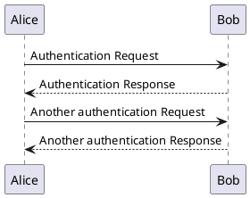

# \[PlantUml\] Local Server

## Cho máy Ubuntu

- Install Java:
    ```text
    sudo apt update
    sudo apt install openjdk-11-jre -y
    ```
- Download PlantUML Server WAR File
    ```text
    wget https://github.com/plantuml/plantuml-server/releases/latest/download/plantuml.war
    ```
- Install Jetty (Lightweight Servlet Container)
    ```text
    sudo apt install jetty9 -y
    ```
- Deploy PlantUML WAR to Jetty:
    ```text
    sudo mv plantuml.war /var/lib/jetty9/webapps/
    ```
- Start Jetty Server
    ```text
    sudo systemctl restart jetty9
    ```
- Access the PlantUML Server
    ```text
    http://<your-ubuntu-PC-IP>:8080/plantuml
    ```
- ⚠️ Optional: Make It Accessible Remotely
    - Open port 8080 in your firewall:
        ```text
        sudo ufw allow 8080
        ```
    - Ensure your router allows traffic to that PC if you're accessing it from outside your local network.

## Test your uml



## Docker Server (Ubuntu)

__Plantuml Docker Server for Ubuntu__. Cách này thì tiến trình build các server sẽ khá là nhanh, mặc dù là khá tốn tài nguyên máy _(RAM)_.

1. Tải về
    ```sudo title="Tải về"
    sudo docker pull plantuml/plantuml-server:jetty
    ```
    ‼️ [_(Tải về Docker tham khảo ở đây)_](https://docs.docker.com/engine/install/ubuntu/)
1. Khởi Chạy
    ```sudo title="Khởi chạy"
    sudo docker run -d -p 8080:8080 plantuml/plantuml-server:jetty
    ```
1. Dừng tiến trình
    - Tìm kiếm tiến trình bằng lệnh sau. Tìm kiếm miền __CONTAINER ID__/__NAMES__
        ```sudo
        sudo docker ps
        ```
    - sudo u với __CONTAINER ID__/__NAMES__ bên trên
        ```sudo
        sudo docker rm 
        ```