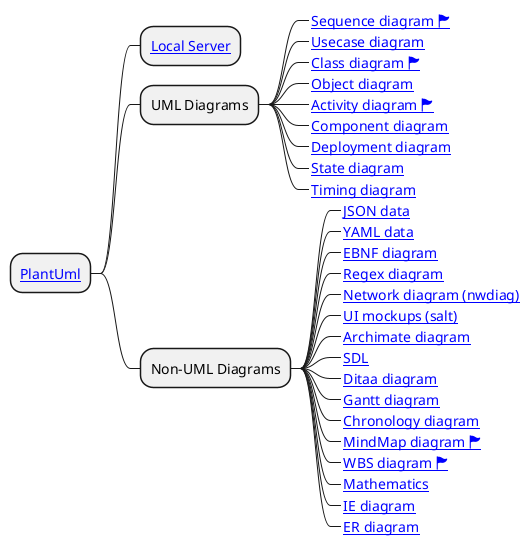

# PlantUml

## Giới thiệu

PlantUML là một công cụ rất linh hoạt tạo điều kiện tạo ra sự tạo ra nhanh chóng và đơn giản của một loạt các sơ đồ.

```puml
@startmindmap
skinparam backgroundcolor transparent
!$URL = "/Markup/PlantUml"

* [[$URL/plantuml/ PlantUml]]
** [[$URL/plantuml-local-server/ Local Server]]
** UML Diagrams
***_ [[$URL/plantuml-sequence-diagram/ Sequence diagram 🏲]]
***_ [[$URL/plantuml-usecase-diagram/ Usecase diagram]]
***_ [[$URL/plantuml-class-diagram/ Class diagram 🏲]]
***_ [[$URL/plantuml-object-diagram/ Object diagram]]
***_ [[$URL/plantuml-activity-diagram/ Activity diagram 🏲]]
***_ [[$URL/plantuml-component-diagram/ Component diagram]]
***_ [[$URL/plantuml-deployment-diagram/ Deployment diagram]]
***_ [[$URL/plantuml-state-diagram/ State diagram]]
***_ [[$URL/plantuml-timing-diagram/ Timing diagram]]
** Non-UML Diagrams
***_ [[$URL/plantuml-json-data/ JSON data]]
***_ [[$URL/plantuml-yaml-data/ YAML data]]
***_ [[$URL/plantuml-ebnf-diagram/ EBNF diagram]]
***_ [[$URL/plantuml-regex-diagram/ Regex diagram]]
***_ [[$URL/plantuml-network-diagram-nwdiag/ Network diagram (nwdiag)]]
***_ [[$URL/plantuml-ui-mockups-salt/ UI mockups (salt)]]
***_ [[$URL/plantuml-archimate-diagram/ Archimate diagram]]
***_ [[$URL/plantuml-sdl/ SDL]]
***_ [[$URL/plantuml-ditaa-diagram/ Ditaa diagram]]
***_ [[$URL/plantuml-gantt-diagram/ Gantt diagram]]
***_ [[$URL/plantuml-chronology-diagram/ Chronology diagram]]
***_ [[$URL/plantuml-mindmap-diagram/ MindMap diagram 🏲]]
***_ [[$URL/plantuml-wbs-diagram/ WBS diagram 🏲]]
***_ [[$URL/plantuml-mathematics/ Mathematics]]
***_ [[$URL/plantuml-ie-diagram/ IE diagram]]
***_ [[$URL/plantuml-er-diagram/ ER diagram]]

@endmindmap
```