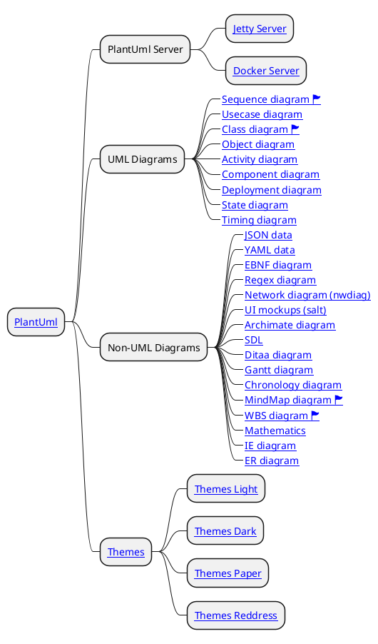

# PlantUml

PlantUML là một công cụ rất linh hoạt tạo điều kiện tạo ra sự tạo ra nhanh chóng và đơn giản của một loạt các sơ đồ.

## PlantUML

### Tóm Tắt

1. Chủ yếu mình dùng _{{ book("Docker Server", "plantuml", "plantuml-docker-server") }}_
1. Các loại đồ thị hay dùng nhất là
	- {{ book("Sequence diagram", "plantuml", "plantuml-sequence-diagram") }} để vẽ đồ thị 
	- {{ book("Class diagram", "plantuml", "plantuml-class-diagram") }} để vẽ biển đồ quan hệ trong lập trình.
	- {{ book("MindMap diagram", "plantuml", "plantuml-mindmap-diagram") }} để vẽ sơ đồ tư duy
	- {{ book("WBS diagram", "plantuml", "plantuml-wbs-diagram") }} để vẽ đồ thị phả hệ

### Nội Dung

