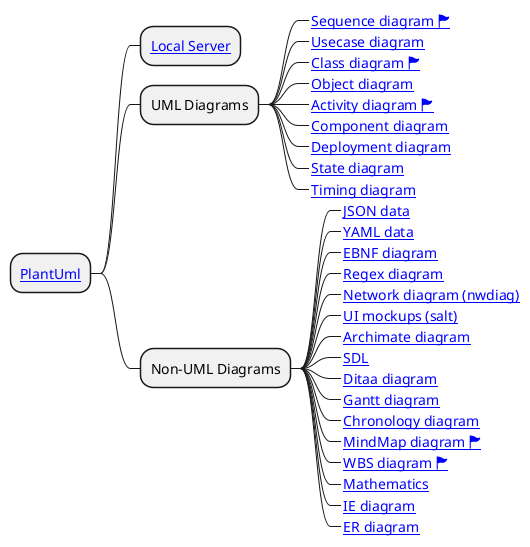

# PlantUml

## Giới thiệu

PlantUML là một công cụ rất linh hoạt tạo điều kiện tạo ra sự tạo ra nhanh chóng và đơn giản của một loạt các sơ đồ.

## Danh Sách

### UML Diagrams

1. [Sequence diagram 🏲](plantuml-sequence-diagram.md)
1. [Usecase diagram](plantuml-usecase-diagram.md)
1. [Class diagram 🏲](plantuml-class-diagram.md)
1. [Object diagram](plantuml-object-diagram.md)
1. [Activity diagram 🏲](plantuml-activity-diagram.md)
1. [Component diagram](plantuml-component-diagram.md)
1. [Deployment diagram](plantuml-deployment-diagram.md)
1. [State diagram](plantuml-state-diagram.md)
1. [Timing diagram](plantuml-timing-diagram.md)

### Non-UML Diagrams

1. [JSON data](plantuml-json-data.md)
1. [YAML data](plantuml-yaml-data.md)
1. [EBNF diagram](plantuml-ebnf-diagram.md)
1. [Regex diagram](plantuml-regex-diagram.md)
1. [Network diagram (nwdiag)](plantuml-network-diagram-nwdiag.md)
1. [UI mockups (salt)](plantuml-ui-mockups-salt.md)
1. [Archimate diagram](plantuml-archimate-diagram.md)
1. [SDL](plantuml-sdl.md)
1. [Ditaa diagram](plantuml-ditaa-diagram.md)
1. [Gantt diagram](plantuml-gantt-diagram.md)
1. [Chronology diagram](plantuml-chronology-diagram.md)
1. [MindMap diagram 🏲](plantuml-mindmap-diagram.md)
1. [WBS diagram 🏲](plantuml-wbs-diagram.md)
1. [Mathematics](plantuml-mathematics.md)
1. [IE diagram](plantuml-ie-diagram.md)
1. [ER diagram](plantuml-er-diagram.md)
