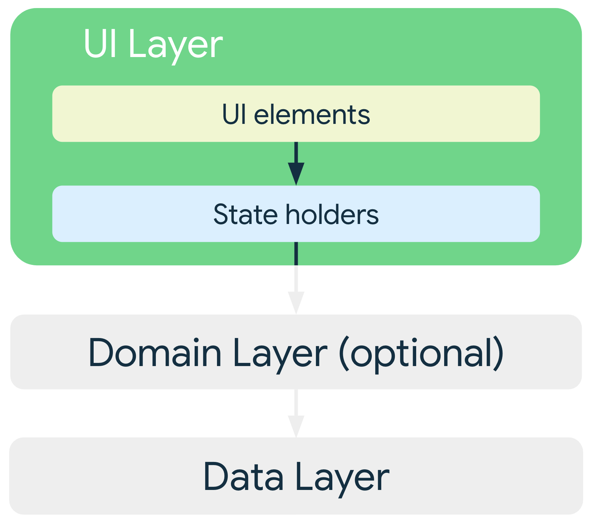
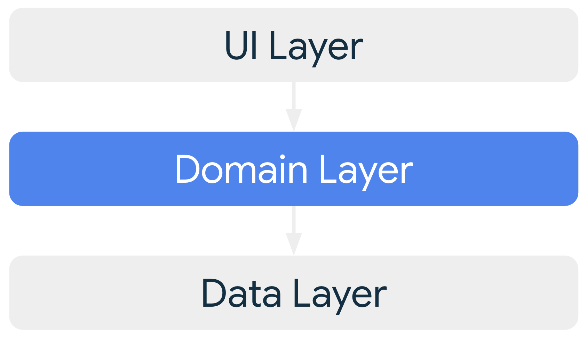

# App Architecture

> [Ref](https://developer.android.com/topic/architecture)

## Về kiến ​​trúc ứng dụng

**Kiến trúc ứng dụng** Là nền tảng của _ứng dụng Android chất lượng cao_. Kiến trúc được xác định rõ ràng cho phép ứng dụng <mark>có thể mở rộng, có thể bảo trì, có thể thích ứng</mark> với hệ sinh thái ngày càng mở rộng của thiết bị Android, bao gồm điện thoại, máy tính bảng, thiết bị gập, thiết bị ChromeOS, màn hình ô tô và XR.

Một ứng dụng Android điển hình bao gồm nhiều thành phần ứng dụng, chẳng hạn như **services**, **content providers**, và **broadcast receivers**... Bạn cần khai báo các thành phần này trong **App Manifest**,

Giao diện người dùng của ứng dụng cũng là một thành phần. Trong quá khứ, giao diện người dùng được xây dựng bằng nhiều [Activity](android-activity.md). Tuy nhiên, các ứng dụng hiện đại sử dụng kiến ​​trúc **một Activity duy nhất**. Một Activity duy nhất đóng vai trò là vùng chứa cho các màn hình được triển khai dưới dạng các [Fragment](android-fragment.md).

<mark>Ứng dụng có thể chạy trên nhiều thiết bị khác nhau</mark>, không chỉ bao gồm điện thoại mà còn cả máy tính bảng, thiết bị gập, thiết bị ChromeOS, v.v. Ứng dụng có thể xoay dọc, ngang, thay đổi về cấu hình, cho thiết bị gập,... buộc ứng dụng của bạn phải <u>sắp xếp lại giao diện người dùng</u>, điều này ảnh hưởng đến dữ liệu và trạng thái của ứng dụng.

Thiết bị di động — _ngay cả thiết bị màn hình lớn_ — đều bị <mark>hạn chế về tài nguyên</mark>, do đó, bất kỳ lúc nào, hệ điều hành có thể dừng một số quy trình ứng dụng để nhường chỗ cho các quy trình mới.

Trong môi trường hạn chế về tài nguyên, các thành phần trong ứng dụng của bạn có thể được khởi chạy riêng lẻ và không theo thứ tự; hơn nữa, <mark>hệ điều hành hoặc người dùng có thể phá hủy chúng bất cứ lúc nào</mark>. Do đó, <mark>không lưu trữ bất kỳ dữ liệu hoặc trạng thái ứng dụng nào trong các thành phần ứng dụng của bạn. Các thành phần ứng dụng của bạn phải khép kín, độc lập với nhau.</mark>

!!! note "Ghi Nhớ"
    1. Xây dựng kiến trúc
    1. Xây dựng quanh các giao diện người dùng
    1. Có thể chạy trên nhiều thiết bị
    1. Giảm thiểu tài nguyên sử dụng

## Nguyên tắc kiến ​​trúc

Khi các ứng dụng Android ngày càng lớn, việc xác định một kiến ​​trúc cho phép ứng dụng mở rộng quy mô là rất quan trọng. Một kiến ​​trúc ứng dụng được thiết kế tốt sẽ xác định ranh giới giữa các phần của ứng dụng và trách nhiệm mà mỗi phần nên đảm nhiệm.

- **Phân tách các mối quan tâm**
    - Hãy thiết kế kiến ​​trúc ứng dụng của bạn theo một vài nguyên tắc cụ thể.
    - Đảm bảo nắm rõ về vòng đời và hoạt động của [Activities](android-activity.md) và [Fragment](android-fragment.md)
- **Bố cục thích ứng**: Ứng dụng của bạn cần xử lý mượt mà các thay đổi cấu hình, chẳng hạn như xoay hoặc đổi hướng, thay đổi kích thước.
- **Xây dựng giao diện người dùng dựa trên mô hình dữ liệu**: Ứng dụng nên xây dựng giao diện người dùng (UI) dựa trên các mô hình dữ liệu, tốt nhất là các mô hình dữ liệu bền vững.
    - Người dùng sẽ không bị mất dữ liệu nếu hệ điều hành Android gỡ bỏ ứng dụng của bạn để giải phóng tài nguyên.
    - Ứng dụng của bạn vẫn tiếp tục hoạt động ngay cả khi kết nối mạng bị gián đoạn hoặc không khả dụng.
- **Nguồn thông tin duy nhất**: bạn nên chỉ định một nguồn dữ liệu duy nhất (SSOT) cho kiểu dữ liệu đó. <mark>SSOT là chủ sở hữu của dữ liệu đó, và chỉ SSOT mới có thể sửa đổi hoặc thay đổi dữ liệu</mark>. Mô hình này có nhiều lợi ích:
    - Tập trung tất cả các thay đổi đối với một loại dữ liệu cụ thể vào một nơi duy nhất.
    - Bảo vệ dữ liệu để các đối tượng khác không thể can thiệp vào dữ liệu.
    - Giúp theo dõi các thay đổi trong dữ liệu dễ dàng hơn, nhờ đó, việc phát hiện lỗi cũng thuận lợi hơn.
- **Luồng dữ liệu một chiều**: Nguyên tắc nguồn dữ liệu duy nhất thường được sử dụng với mô hình luồng dữ liệu một chiều (UDF). Trong UDF, trạng thái chỉ chảy theo một hướng, điển hình là từ thành phần cha sang thành phần con. Các sự kiện làm thay đổi dữ liệu chảy theo hướng ngược lại.

!!! success "Ghi nhớ"
    - Nắm vững vòng đời của các thành phần ứng dụng để giải phóng tài nguyên hệ thống.
    - Dữ liệu nên có mô hình quản lý, không để chúng rải rác.
    - **SSOT** (_Single source of truth_) các dữ liệu chương trình nên được quản lý bởi một thành phần duy nhất. Không để nhiều thành phần cùng có quyền tác động đến dữ liệu gốc.
    - Trạng thái luồng dữ liệu thay đổi đảm bảo một chiều, ví dụ cha sang con.

## Kiến Trúc Gợi Ý

### Kiến Trúc Tổng Quan

Theo các nguyên tắc kiến ​​trúc chung, mỗi ứng dụng nên có ít nhất hai lớp:

1. **Lớp giao diện người dùng (UI Layer)**: Hiển thị dữ liệu ứng dụng trên màn hình.
2. **Lớp dữ liệu (Data Layer)**: Chứa logic nghiệp vụ của ứng dụng và hiển thị dữ liệu ứng dụng.
3. **Lớp miền (Domain Layer)** chỉ là lựa chọn, có thể có hoặc không để trung gian thao tác giữa hai phân vùng.

<figure markdown="span">
    
    <figcaption>Hình 1. Sơ đồ kiến ​​trúc điển hình của một ứng dụng.</figcaption>
</figure>

### Lớp Giao Diện

Vai trò của lớp giao diện người dùng (hay lớp trình bày ) là hiển thị dữ liệu ứng dụng trên màn hình. Bất cứ khi nào dữ liệu thay đổi, dù là do tương tác của người dùng (chẳng hạn như nhấn nút) hay do dữ liệu đầu vào bên ngoài (chẳng hạn như phản hồi mạng), giao diện người dùng cần cập nhật để phản ánh những thay đổi đó.

Lớp giao diện người dùng bao gồm hai loại cấu trúc:

- Các phần tử giao diện người dùng (UI) hiển thị dữ liệu trên màn hình. Bạn xây dựng các phần tử này bằng cách sử dụng các chức năng của Jetpack Compose để hỗ trợ bố cục thích ứng.
- Các đối tượng nắm giữ dữ liệu (như... **ViewModel**) là những đối tượng lưu trữ dữ liệu, hiển thị dữ liệu đó cho giao diện người dùng và xử lý logic.

<figure markdown="span">
    
    <figcaption>Hình 2. Vai trò của lớp giao diện người dùng trong kiến ​​trúc ứng dụng.</figcaption>
</figure>

> Tham khảo: [Về lớp giao diện ứng dụng](https://developer.android.com/jetpack/guide/ui-layer)

### Lớp Dữ Liệu

**Lớp dữ liệu** của một ứng dụng chứa logic nghiệp vụ . Logic nghiệp vụ là thứ tạo ra giá trị cho ứng dụng của bạn — nó bao gồm các quy tắc xác định cách ứng dụng tạo, lưu trữ và thay đổi dữ liệu.

Lớp dữ liệu được tạo thành từ các kho lưu trữ, mỗi kho có thể chứa từ không đến nhiều nguồn dữ liệu. Bạn nên tạo một lớp kho lưu trữ cho mỗi loại dữ liệu khác nhau mà bạn xử lý trong ứng dụng của mình. Ví dụ, bạn có thể tạo một **MoviesRepository** lớp cho dữ liệu liên quan đến phim ảnh hoặc một **PaymentsRepository** lớp cho dữ liệu liên quan đến thanh toán.

<figure markdown="span">
    
    <figcaption>Hình 3. Vai trò của lớp dữ liệu trong kiến ​​trúc ứng dụng.</figcaption>
</figure>

Các lớp kho lưu trữ chịu trách nhiệm cho những việc sau:

Hiển thị dữ liệu cho phần còn lại của ứng dụng
Tập trung hóa các thay đổi đối với dữ liệu
Giải quyết xung đột giữa nhiều nguồn dữ liệu.
Tách biệt các nguồn dữ liệu khỏi phần còn lại của ứng dụng.
Chứa logic nghiệp vụ
Mỗi lớp nguồn dữ liệu chỉ nên chịu trách nhiệm làm việc với một nguồn dữ liệu duy nhất, có thể là một tệp tin, một nguồn mạng hoặc một cơ sở dữ liệu cục bộ. Các lớp nguồn dữ liệu đóng vai trò là cầu nối giữa ứng dụng và hệ thống trong các hoạt động dữ liệu.

> Tham Khảo: [Về Lớp Dữ Liệu](https://developer.android.com/jetpack/guide/data-layer)

### Lớp Miền (lớp đệm)

Lớp miền là một lớp tùy chọn nằm giữa lớp giao diện người dùng và lớp dữ liệu.

Lớp miền chịu trách nhiệm đóng gói logic nghiệp vụ phức tạp hoặc logic nghiệp vụ đơn giản hơn được tái sử dụng bởi nhiều mô hình giao diện người dùng. Lớp miền là tùy chọn vì không phải tất cả các ứng dụng đều có yêu cầu này. Chỉ sử dụng nó khi cần thiết, ví dụ, để xử lý sự phức tạp hoặc ưu tiên khả năng tái sử dụng.

<figure markdown="span">
    
    <figcaption>Hình 4. Vai trò của lớp miền trong kiến ​​trúc ứng dụng.</figcaption>
</figure>

Các lớp trong lớp miền thường được gọi là các trường hợp sử dụng hoặc các bộ tương tác . Mỗi trường hợp sử dụng nên chịu trách nhiệm cho một chức năng duy nhất. Ví dụ, ứng dụng của bạn có thể có một GetTimeZoneUseCaselớp nếu nhiều mô hình xem dựa vào múi giờ để hiển thị thông báo phù hợp trên màn hình.

> Tham Khảo: [Về Lớp Miền](https://developer.android.com/jetpack/guide/domain-layer)