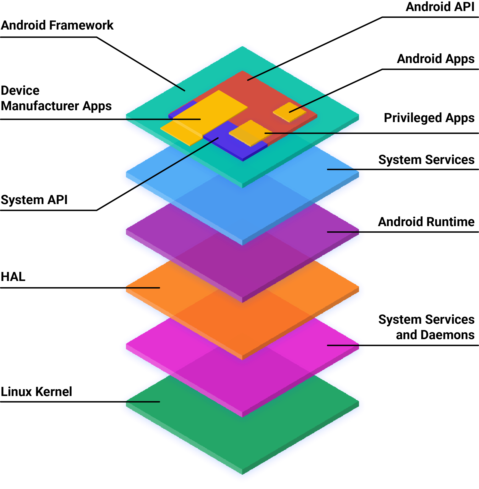

# \[Android\] Architecture Tổng quan về cấu trúc

Dự án nguồn mở Android (AOSP) là mã nguồn Android có thể sửa đổi và được cung cấp công khai. Bất kỳ ai cũng có thể tải xuống và sửa đổi AOSP cho thiết bị của mình. AOSP cung cấp một cách triển khai hoàn chỉnh và đầy đủ chức năng của nền tảng di động Android.

!!! note "Note"
    AOSP không thể hỗ trợ những ứng dụng yêu cầu dịch vụ phụ trợ, chẳng hạn như ứng dụng nhắn tin qua đám mây hoặc dịch vụ vị trí nâng cao. AOSP cũng không bao gồm một bộ ứng dụng đầy đủ cho người dùng cuối có thể cần thiết cho một số loại thiết bị.

Có 2 cấp độ tương thích cho các thiết bị triển khai AOSP: __*khả năng tương thích với AOSP*__ và __*khả năng tương thích với Android*__.

Thiết bị tương thích với AOSP phải tuân thủ danh sách các yêu cầu trong [Tài liệu định nghĩa về khả năng tương thích (CDD)](https://source.android.com/docs/compatibility/cdd). Thiết bị tương thích với Android phải tuân thủ danh sách các yêu cầu trong CDD và __Yêu cầu về phần mềm của nhà cung cấp (VSR)__ cũng như các kiểm thử như trong [Bộ kiểm thử của nhà cung cấp (VTS)](https://source.android.com/docs/core/tests/vts) và [Bộ kiểm thử tính tương thích (CTS)](https://source.android.com/docs/compatibility/cts). Để biết thêm thông tin về khả năng tương thích với Android, hãy tham khảo [Chương trình tương thích với Android](https://source.android.com/docs/compatibility?hl=vi).

## Cấu trúc AOSP

Cấu trúc ngăn xếp của AOSP như sau:

<figure markdown="span">
    
    
    <figcaption></figcaption>
</figure>

Các thuật ngữ được định nghĩa như sau:

### Application

!!! note "Android Apps"
    Một ứng dụng chỉ được tạo bằng Android API. Cửa hàng Google Play được sử dụng rộng rãi để tìm và tải các ứng dụng Android xuống, mặc dù có nhiều lựa chọn thay thế khác. Trong một số trường hợp, nhà sản xuất thiết bị có thể muốn cài đặt sẵn một ứng dụng Android để hỗ trợ chức năng cốt lõi của thiết bị.

!!! note "Privileged App"
    Một ứng dụng được tạo bằng cách kết hợp API Android và API hệ thống. Bạn phải cài đặt sẵn các ứng dụng này dưới dạng ứng dụng đặc quyền trên thiết bị.

!!! note "Device Manufacturer App"
    Một ứng dụng được tạo bằng cách kết hợp API Android, API hệ thống và quyền truy cập trực tiếp vào quá trình triển khai khung Android. Vì nhà sản xuất thiết bị có thể truy cập trực tiếp vào các API không ổn định trong khung Android, nên các ứng dụng này phải được cài đặt sẵn trên thiết bị và chỉ có thể cập nhật khi phần mềm hệ thống của thiết bị được cập nhật.

### API

!!! note "System API"
    System API là API Android chỉ dành cho các đối tác và OEM để đưa vào các ứng dụng đi kèm. Các API này được đánh dấu là `@SystemApi` trong mã nguồn.

!!! note "API Android"
    Android API là API công khai dành cho nhà phát triển ứng dụng Android bên thứ ba. Để biết thông tin về Android API, hãy tham khảo

### Framework

!!! note "Android Framework"
    Một nhóm các lớp, giao diện Java và mã được biên dịch sẵn khác mà các ứng dụng được xây dựng dựa trên đó. Một số phần của khung hiển thị có thể truy cập công khai thông qua việc sử dụng API Android. Các phần khác của khung chỉ có sẵn cho OEM thông qua việc sử dụng API hệ thống. Mã khung Android chạy trong quy trình của một ứng dụng.

### Services

!!! note "System Services"
    Dịch vụ hệ thống là các thành phần theo _module_, tập trung như `system_server`, __SurfaceFlinger__ và __MediaService__. Chức năng do __API Android Framework__ cung cấp sẽ giao tiếp với các <u>dịch vụ hệ thống</u> để <u>truy cập vào phần cứng cơ bản</u>.

### Android Runtime

!!! note "Android runtime (ART)"
    Môi trường __*Java runtime environment*__ cung cấp bởi AOSP. __ART__ thực hiện việc dịch mã byte của ứng dụng thành các chỉ dẫn dành riêng cho bộ xử lý do môi trường thời gian chạy của thiết bị thực thi.

### HAL

!!! note "Hardware abstraction layer (HAL)"
    HAL là một lớp trừu tượng có __giao diện tiêu chuẩn để các nhà cung cấp phần cứng triển khai__. HAL cho phép __Android không phụ thuộc vào việc triển khai trình điều khiển cấp thấp__. Việc sử dụng HAL cho phép bạn triển khai chức năng mà không ảnh hưởng hoặc sửa đổi hệ thống cấp cao hơn.

    Tham khảo thêm tại [HAL overview]().

### Daemons and Background Services

!!! note "Native daemons and libraries"
    __*Native daemons*__ trong lớp này bao gồm `init`, `healthd`, `logd`, và `storaged`. Các daemon này tương tác trực tiếp với kernel hoặc các giao diện khác và không phụ thuộc vào việc triển khai HAL dựa trên không gian người dùng.

    __*Native libraries*__ trong lớp này bao gồm `libc`, `liblog`, `libutils`, `libbinder`, và `libselinux`. Những __*Native libraries*__ tương tác trực tiếp với kernel hoặc các giao diện khác và không phụ thuộc vào việc triển khai HAL dựa trên không gian người dùng.

### Kernel

!!! note "Kernel"
    __Kernel__ là phần trung tâm của bất kỳ hệ điều hành nào và liên kết với phần cứng cơ bản trên thiết bị. Nếu có thể, hạt nhân AOSP được chia thành các _module_ không phụ thuộc vào phần cứng và các _module_ dành riêng cho nhà cung cấp.

## Tham Khảo

- Khái niệm của [__*daemon*__](../Linux/linux-system-daemon.md)
- [Android Architecture](https://source.android.com/docs/core/architecture)