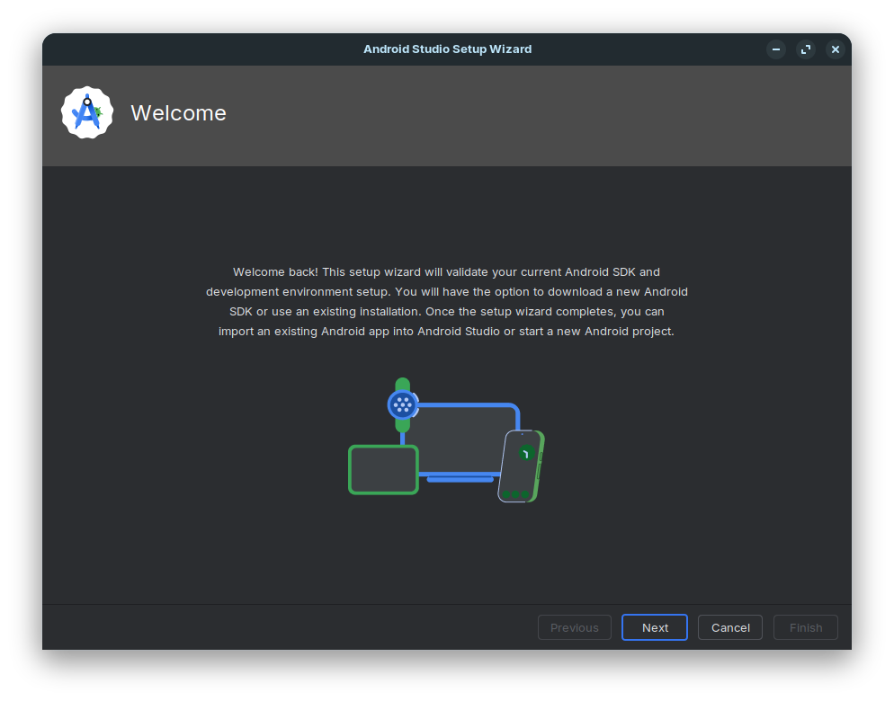
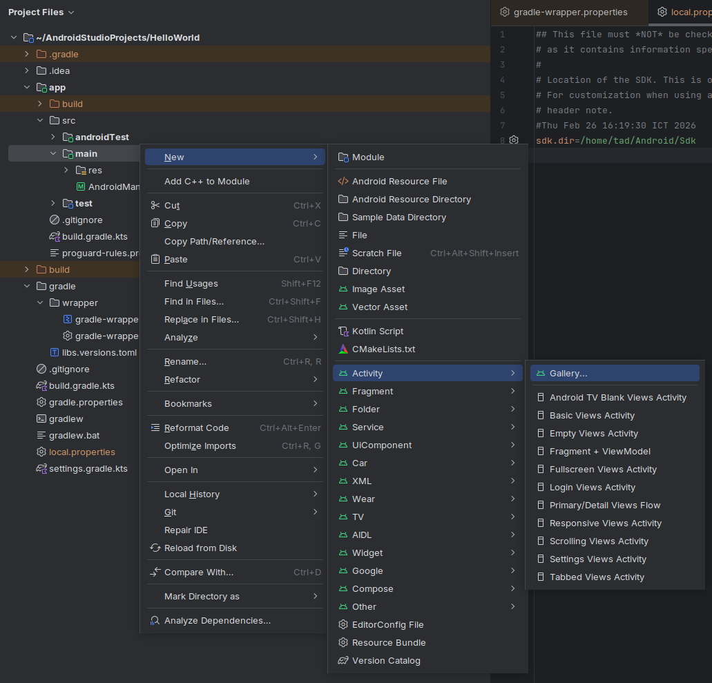
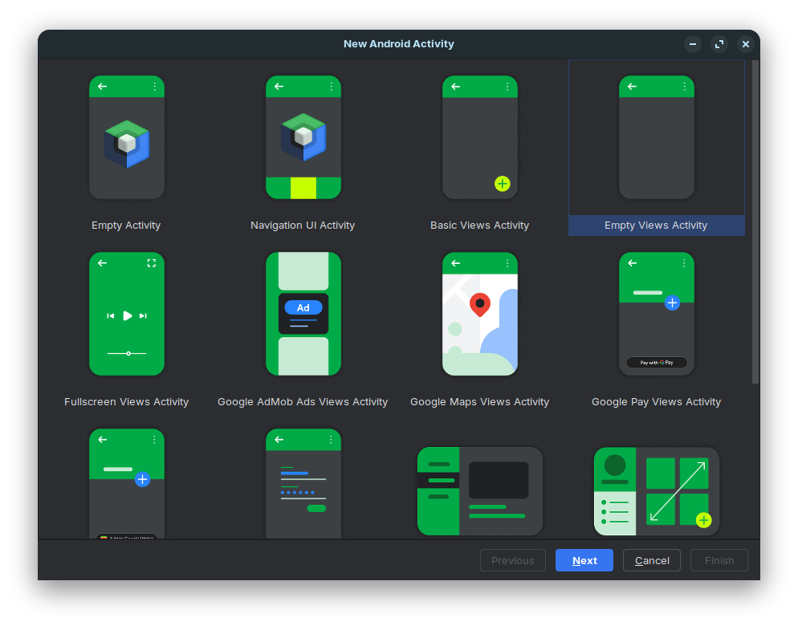
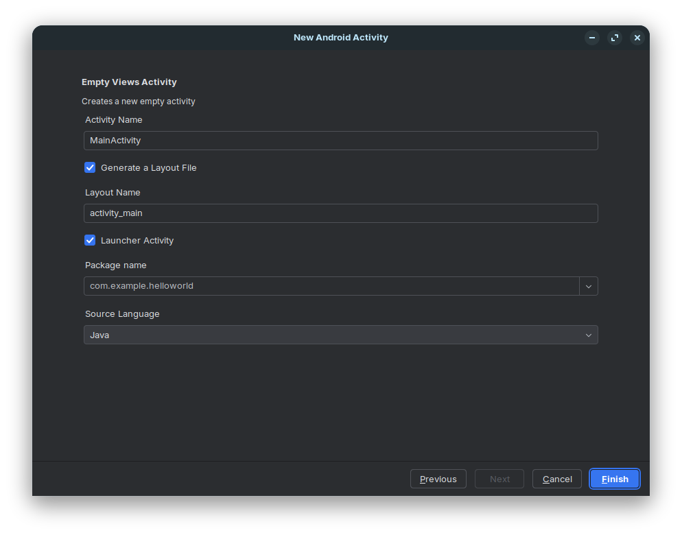

# First Application

> Tạo ứng dụng đầu tiên với **Android Studio**

## Chuẩn Bị

- [Tải về Android Studio](../../DevTools/AndroidStudio/software-android-studio-install.md)

## Tạo Dự Án Mới

### Thiết Lập

#### Welcome

<figure markdown="span">    
    
    <figcaption>Khi mới cài xong thường sẽ có màn hình này</figcaption>
</figure>

- Ở bước này tiếp theo sẽ có các bước hỏi về cài đặt cấu hình. Khi chưa hiểu rõ tốt nhất nên chọn chế độ **Standed** cho nhanh. Với lại sau này vị trí các thư mục cũng được nhất quán dễ tìm kiếm và phát hiện lỗi hơn việc để chế độ _custom_ lại ứng dụng.
- _custom_ hầu như sẽ được dùng khi bạn muốn cài nhiều hơn một **Android Studio** vào thiết bị thôi, lúc này cấu hình sẽ là dựng ứng dụng độc lập môi trường với môi trường chung.

#### New Project

- Tìm nút **New Project...** _(thường trong **File** -> **New** -> **New Project...**)_
- Ở màn hình này chọn **No Activity** nếu muốn hiểu rõ hoạt động của ứng dụng _**Android**_.
- Lập trình cho điện thoại nên mình chọn ở thẻ **Phone and Tablet**

<figure markdown="span">
    
</figure>

#### Configure Project

- Đây là ứng dụng đầu tiên nên phần tên để theo truyền thống, **HelloWorld**
- **Save location** cho biết nơi code dự án sẽ được lưu
- **Language** có hai lựa chọn là _**Java**_ hoặc _**Kotlin**_, khuyến nghị của Google hiện nay là Kotlin nhưng nếu muốn hiểu bản chất mã **Kotlin** từ đâu nên đi từ **Java**. _(Các khái niệm của Android application đều chạy từ Java lên, Kotlin đóng gói và tối ưu lại mã thôi)_.
- Chú ý dòng **Minimum SDK** nên chọn theo đúng phiên bản Android của thiết bị nếu muốn chạy trên thiết bị phần cứng.
    - Thiết bị của mình chạy _API 30 Android 11_ nên chọn _API 30 Android 11_
- **Build configuration laguage** khá quan trọng. Có vẻ nên chọn **Kotlin DSL**, lựa chọn sau chỉ nên dành cho những hệ thống Android cực kỳ cũ.
- Sau đó ấn **Finish**

<figure markdown="span">
    
    <figcaption>New Projects</figcaption>
</figure>

#### Android Studio Prepare

- Ngồi chờ **Android Studio** chạy và cấu hình dự án theo những gì mình điền ở phần trước.
- Xem thông tin ở dưới có thể thấy có một tiến trình tên là **Gradle** đang chạy.

<figure markdown="span">
    
</figure>

Sau khi thành công thì dự án cũng không có gì đâu. Các tệp khởi tạo cũng khá nhiều như này.

```text
drwxrwxr-x 7 tad tad 4096 Thg 2  26 15:58 ./
drwxrwxr-x 4 tad tad 4096 Thg 2  26 15:57 ../
drwxrwxr-x 3 tad tad 4096 Thg 2  26 15:57 app/
drwxrwxr-x 3 tad tad 4096 Thg 2  26 15:58 build/
-rw-rw-r-- 1 tad tad  167 Thg 2  26 15:57 build.gradle.kts
-rw-rw-r-- 1 tad tad  225 Thg 2  26 15:57 .gitignore
drwxrwxr-x 5 tad tad 4096 Thg 2  26 15:57 .gradle/
drwxrwxr-x 3 tad tad 4096 Thg 2  26 15:57 gradle/
-rw-rw-r-- 1 tad tad 1255 Thg 2  26 15:57 gradle.properties
-rwxrw-r-- 1 tad tad 8728 Thg 2  26 15:57 gradlew*
-rw-rw-r-- 1 tad tad 2937 Thg 2  26 15:57 gradlew.bat
drwxrwxr-x 2 tad tad 4096 Thg 2  26 15:57 .idea/
-rw-rw-r-- 1 tad tad  423 Thg 2  26 15:57 local.properties
-rw-rw-r-- 1 tad tad  534 Thg 2  26 15:57 settings.gradle.kts
```

### Chạy Thử

<figure markdown="span">
    
    <figcaption>Ấn vào nút ▸ để chạy thử dự án.</figcaption>
</figure>
<figure markdown="span">
    
    <figcaption>Sẽ có lỗi như này</figcaption>
</figure>

Chuyện này do ở bước [New Project](#new-project) đã chọn cấu hình là **No Activity**, giờ là lúc tạo **Activity** cho ứng dụng.

## Tạo Activity

- Tạo activity mới qua công cụ như này.

<figure markdown="span">
    
</figure>

- Chọn **Empty Views Activity**
    - _Các mục khác là các **Template** có sẵn sẽ tạo ra các code mẫu cho một vài ứng dụng phổ thông. Giờ chưa cần dùng đến._
- Sau đó ấn **Next**

<figure markdown="span">
    
</figure>

- Phần tên cứ để vậy là được
- Chú ý dấu tick chọn chạy **Activity** này ở chế độ mặc định
- Phần **Source Language** để chọn sang **Java**

<figure markdown="span">
    
</figure>

Chạy lại ứng dụng một lần nữa và ta có:

<figure markdown="span">
    
</figure>

Sau khi tạo xong _activity_ đầu tiên ta có các tệp mới sau:

- **MainActivity.java** (`./app/src/main/java/com/example/helloworld/MainActivity.java`): Tệp mã nguồn
    ```text title="MainActivity.java"
    app/src/main/java/
    └── com
        └── example
            └── helloworld
                └── MainActivity.java
    ```
- **activity_main.xml** (`./app/src/main/res/layout/activity_main.xml`): Tệp đồ họa
    ```text title="MainActivity.java"
    app/src/main/res/layout/
    └── activity_main.xml
    ```
- Và thay đổi trong **AndroidManifest.xml**(`/app/src/main/AndroidManifest.xml`) là
    ```diff
    diff --git a/app/src/main/AndroidManifest.xml b/app/src/main/AndroidManifest.xml
    index 9082407..bffdf0f 100644
    --- a/app/src/main/AndroidManifest.xml
    +++ b/app/src/main/AndroidManifest.xml
    @@ -10,6 +10,15 @@
            android:label="@string/app_name"
            android:roundIcon="@mipmap/ic_launcher_round"
            android:supportsRtl="true"
    -        android:theme="@style/Theme.HelloWorld" />
    +        android:theme="@style/Theme.HelloWorld">
    +        <activity
    +            android:name=".MainActivity"
    +            android:exported="true">
    +            <intent-filter>
    +                <action android:name="android.intent.action.MAIN" />
    +                <category android:name="android.intent.category.LAUNCHER" />
    +            </intent-filter>
    +        </activity>
    +    </application>
    
    </manifest>
    ```

Để hiểu kỹ hơn về **Activity**, xem bài viết [Android Activity](android-activity.md)

## Dựng Bằng CLI

> Cái này mới kiểm thử việc chạy CLI trên **Ubuntu**

Trên Ubuntu, sau các bước trên nếu muốn dựng ứng dụng qua CLI thì dùng các bước sau:

1. Chuyển mode. Thông thường tệp gradlew luôn có sẵn ở ngoài cùng nhưng sẽ không được cài ở chế dộ có thể hoạt động. Chạy lệnh sau để chuyển mode
    ```bash
    sudo chmod +x ./gradlew
    ```
    _Trên thực tế, `gradlew` cũng chỉ là một tệp **scripts** chạy trên **shell**. Có thể đọc bằng `cat ./gradlew`._
1. Chạy lệnh sau để lấy các _**tasks**_ chính
    ```bash
    ./gradlew tasks
    ```
1. Thường thì với các cấu hình phổ thông thì sẽ có trả về các lệnh như này:
    ```bash
    > Task :tasks

    ------------------------------------------------------------
    Tasks runnable from root project 'HelloWorld'
    ------------------------------------------------------------

    Android tasks
    -------------
    signingReport - Displays the signing info for the base and test modules

    Build tasks
    -----------
    assemble - Assemble main outputs for all the variants.
    assembleAndroidTest - Assembles all the Test applications.
    assembleUnitTest - Assembles all the unit test applications.
    build - Assembles and tests this project.
    buildDependents - Assembles and tests this project and all projects that depend on it.
    buildNeeded - Assembles and tests this project and all projects it depends on.
    bundle - Assemble bundles for all the variants.
    clean - Deletes the build directory.
    compileDebugAndroidTestSources
    compileDebugSources
    compileDebugUnitTestSources
    compileReleaseSources
    ...
    ...
    ```
    _(Văn bản quá dài nên lược bớt)_
1. Chạy lệnh sau sẽ dựng được chương trình
    - Dựng tất cả
        ```bash
        ./gradlew assemble
        ```
    - Dựng **Debug**
        ```bash
        ./gradlew assembleDebug
        ```
    - Dựng **Release**
        ```bash
        ./gradlew assembleRelease
        ```
1. Kết quả sẽ là các tệp APK tại:

| Files                                                      | _Comments_                                          |
| :--------------------------------------------------------- | :-------------------------------------------------- |
| `./app/build/outputs/apk/release/app-release-unsigned.apk` | Tệp này là dựng qua _**./gradlew assembleRelease**_ |
| `./app/build/outputs/apk/debug/app-debug.apk`              | Tệp này là dựng qua _**./gradlew assembleDebug**_   |
| `./app/build/intermediates/apk/debug/app-debug.apk`        | _Tệp này là dựng qua ứng dụng **Android Studio**_   |