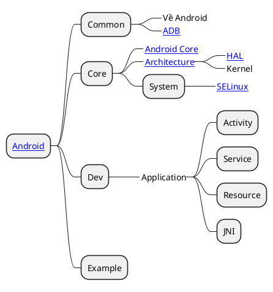

# \[Android\] Android OS

## Android?

Về cơ bản __Android__ cũng là __Linux__, nhưng mà theo sự phát triển của __Google__ khiến cái hệ điều hành này có một hệ sinh thái riêng và sự phát triển độc lập.

## RoadMap

## What is API

- [API Levels](https://apilevels.com/)

## Reference

- [Android On Wikipedia](https://en.wikipedia.org/wiki/Android_(operating_system))