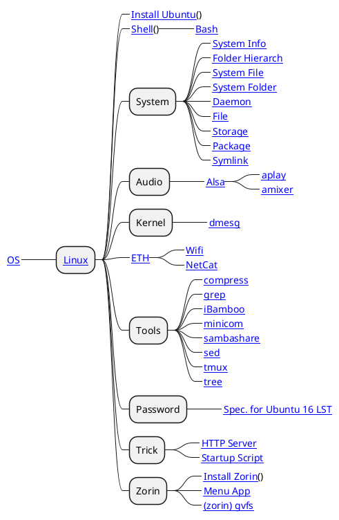

# Ubuntu

## Overview

Có khá nhiều hệ điều hành họ nhà __Linux__ vì __Linux__ là cha đẻ của các hệ điều hành sau này. Việc phát triển lớn mạnh nhất của hệ điều hành này là do hệ điều hành này là `open source`. Vì thế nên hệ điều hành này có sự phát triển vượt trội và được làm lõi phát triển cho rất nhiều hệ điều hành sau này, cụ thể là hai hệ điều hành __Ubuntu__ và __Android__.

## Map

## Install

Cài đặt __Ubuntu__ rất đơn giản điều đầu tiên là cần