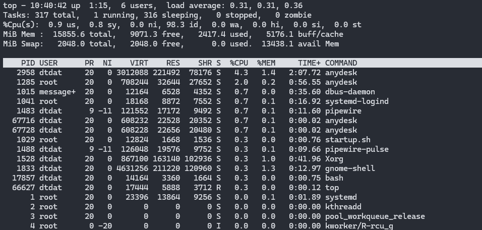

# System Info

## OS Information

=== "hostnamectl"
    Để kiểm tra phiên bản hệ điều hành kiểu, thông tin thiết bị đang sử dụng thì sử dụng lệnh: `hostnamectl`

    ```bash
    hostnamectl
    ```
    ```text title="Kết Quả"
     Static hostname: dtdat-OptiPlex-7050
           Icon name: computer-desktop
             Chassis: desktop 🖥️
          Machine ID: 4a91574106e24e4bb18349616726377e
             Boot ID: e31648a38281492880aaa98121849eb6
    Operating System: Ubuntu 24.04.2 LTS
              Kernel: Linux 6.8.0-88-generic
        Architecture: x86-64
     Hardware Vendor: Dell Inc.
      Hardware Model: OptiPlex 7050
    Firmware Version: 1.5.2
       Firmware Date: Mon 2017-06-19
        Firmware Age: 8y 5month 2w 2d
    ```
=== "/etc/os-release"
    Một cách khác là có thể đọc trực tiếp từ tệp `/etc/os-release`.

    ```bash
    sudo cat /etc/os-release
    ```
    ```text title="Kết Quả"
    PRETTY_NAME="Ubuntu 24.04.2 LTS"
    NAME="Ubuntu"
    VERSION_ID="24.04"
    VERSION="24.04.2 LTS (Noble Numbat)"
    VERSION_CODENAME=noble
    ID=ubuntu
    ID_LIKE=debian
    HOME_URL="https://www.ubuntu.com/"
    SUPPORT_URL="https://help.ubuntu.com/"
    BUG_REPORT_URL="https://bugs.launchpad.net/ubuntu/"
    PRIVACY_POLICY_URL="https://www.ubuntu.com/legal/terms-and-policies/privacy-policy"
    UBUNTU_CODENAME=noble
    LOGO=ubuntu-logo
    ```
=== "lsb_release"
    Lệnh `lsb_release -a` cũng có thể được sử dụng để đọc thông tin OS. Nhưng không được nhiều giá trị cho lắm.

    ```bash
    lsb_release -a
    ```
    ```text title="Kết Quả"
    No LSB modules are available.
    Distributor ID: Ubuntu
    Description:    Ubuntu 24.04.2 LTS
    Release:        24.04
    Codename:       noble
    ```

## Memory

=== "free"
    Sử dụng lệnh `free` để đọc dữ liệu của RAM và bao nhiêu đang được sử dụng:

    Kiểm tra thông tin của RAM với câu lệnh `free -h`

    ```bash
    $ free -h
                   total        used        free      shared  buff/cache   available
    Mem:            15Gi       1.8Gi        12Gi       226Mi       1.6Gi        13Gi
    Swap:          2.0Gi          0B       2.0Gi
    ```
=== "/proc/meminfo"
    Tệp `/proc/meminfo` cũng lưu lại tình trạng trực tiếp của __memory__.

    ```bash
    sudo cat /proc/meminfo
    ```
    ```text title="Kết Quả"
    sudo cat /proc/meminfo
    MemTotal:       16236108 kB
    MemFree:        13240436 kB
    MemAvailable:   14341892 kB
    Buffers:          159008 kB
    Cached:          1376768 kB
    SwapCached:            0 kB
    Active:          1903572 kB
    Inactive:         456844 kB
    ```

Ngoài ra, muốn theo dõi trực tiếp mức độ tiêu thụ __*memory*__ của thiết bị trên từng __*process*__ có thể dùng lệnh `top`. Xem đầy đủ tại [Live Session](#live-session)

## CPU Usage

=== "sysstat"
    Gói `sysstat` chứa bộ công cụ để theo dõi cũng như kiểm tra thông tin __*CPU*__. Nhưng đôi khi nó không có sẵn. Nếu không có chỉ cần tải về thôi.

    ```text title="Tải về sysstat"
    sudo apt-get update
    sudo apt-install sysstat
    ```
    === "Common"
        Sử dụng lệnh `mpstat` để xem tiến trình tiêu thụ của cpu.

        ```bash
        mpstat
        ```
        ```text title="Kết Quả"
        Linux 6.8.0-88-generic (dtdat-OptiPlex-7050)    12/04/2025      _x86_64_        (8 CPU)

        12:13:30 PM  CPU    %usr   %nice    %sys %iowait    %irq   %soft  %steal  %guest  %gnice   %idle
        12:13:30 PM  all    0.08    0.00    0.04    0.01    0.00    0.00    0.00    0.00    0.00   99.87
        ```

        Thêm số $n$ đằng sau nữa thì lệnh sẽ tự động cập nhật và phải hồi sau $n$ giây. Ví dụ dưới này là cập nhật danh sách mỗi 1 giây.

        ```bash
        mpstat 1
        ```
    === "ALL"
        Sử dụng với cờ `-P ALL` thì sẽ xem được __$CPU__ trên mỗi nhân mà thiết bị sở hữu.

        ```bash
        mpstat -P ALL
        ```
        ```text title="Kết Quả"
        Linux 6.8.0-88-generic (dtdat-OptiPlex-7050)    12/04/2025      _x86_64_        (8 CPU)

        12:13:41 PM  CPU    %usr   %nice    %sys %iowait    %irq   %soft  %steal  %guest  %gnice   %idle
        12:13:41 PM  all    0.08    0.00    0.04    0.01    0.00    0.00    0.00    0.00    0.00   99.87
        12:13:41 PM    0    0.06    0.00    0.04    0.01    0.00    0.00    0.00    0.00    0.00   99.89
        12:13:41 PM    1    0.16    0.00    0.06    0.00    0.00    0.01    0.00    0.00    0.00   99.76
        12:13:41 PM    2    0.21    0.00    0.07    0.01    0.00    0.00    0.00    0.00    0.00   99.72
        12:13:41 PM    3    0.06    0.01    0.04    0.00    0.00    0.00    0.00    0.00    0.00   99.89
        12:13:41 PM    4    0.04    0.00    0.03    0.00    0.00    0.00    0.00    0.00    0.00   99.93
        12:13:41 PM    5    0.05    0.00    0.02    0.01    0.00    0.00    0.00    0.00    0.00   99.92
        12:13:41 PM    6    0.05    0.00    0.03    0.01    0.00    0.00    0.00    0.00    0.00   99.91
        12:13:41 PM    7    0.03    0.00    0.03    0.00    0.00    0.00    0.00    0.00    0.00   99.94
        ```

        Thêm số $n$ đằng sau nữa thì lệnh sẽ tự động cập nhật và phải hồi sau $n$ giây. Ví dụ dưới này là cập nhật danh sách mỗi 1 giây.

        ```bash
        mpstat -P ALL 1
        ```
=== "/proc/stat"
    Lệnh sau để đọc thông tin của CPU từ tệp tin của hệ thống.

    ```bash
    sudo cat /proc/stat
    ```
    ```text title="Kết Quả"
    cpu  111787 2054 51331 135361914 8266 0 2167 0 0 0
    cpu0 10261 15 6612 16926041 1482 0 2 0 0 0
    cpu1 27262 9 10355 16883625 605 0 2157 0 0 0
    cpu2 35710 7 11060 16893443 1039 0 0 0 0 0
    cpu3 9831 1055 6445 16926608 772 0 0 0 0 0
    cpu4 6987 284 4323 16933333 774 0 0 0 0 0
    cpu5 9293 1 3898 16931589 972 0 0 0 0 0
    cpu6 8027 666 4351 16930401 1915 0 0 0 0 0
    cpu7 4414 13 4284 16936870 704 0 5 0 0 0
    intr 54858923 52 0 0 0 0 0 0 0 0 5 0 0 0 0 0 0 0 0 0 0 33 0 0 4 0 0 0 0 0 0 0 0 0 0 0 0 0 0 0 0 0 0 0 0 0 0 0 0 0 0 0 0 0 0 0 0 0 0 0 0 0 0 0 0 0 0 0 0 0 0 0 0 0 0 0 0 0 0 0 0 0 0 0 0 0 0 0 0 0 0 0 0 0 0 0 0 0 0 0 0 0 0 0 0 0 0 0 0 0 0 0 0 0 0 0 0 0 0 0 0 0 0 0 0 1583 4859 0 0 0 0 0 0 0 4521846 877 26702 19196 17637 26870 19197 36620 29420 27116 75 52 21418 2362 0 0 0 0 0 0 0 0 0 0 0 0 0 0 0 0 0 0 0 0 0 0 0 0 0 0 0 0 0 0 0 0 0 0 0 0 0 0 0 0 0 0 0 0 0 0 0 0 0 0 0 0 0 0 0 0 0 0 0 0 0 0 0 0 0 0 0 0 0 0 0 0 0 0 0 0 0 0 0 0 0 0 0 0 0 0 0 0 0 0 0 0 0 0 0 0 0 0 0 0 0 0 0 0 0 0 0 0 0 0 0 0 0 0 0 0 0 0 0 0 0 0 0 0 0 0 0 0 0 0 0 0 0 0 0 0 0 0 0 0 0 0 0 0 0 0 0 0 0 0 0 0 0 0 0 0 0 0 0 0 0 0 0 0 0 0 0 0 0 0 0 0 0 0 0 0 0 0 0 0 0 0 0 0 0 0 0 0 0 0 0 0 0 0 0 0 0 0 0 0 0 0 0 0 0 0 0 0 0 0 0 0 0 0 0 0 0 0 0 0 0 0 0 0 0 0 0 0 0 0 0 0 0 0 0 0 0 0 0 0 0 0 0 0 0 0 0 0 0 0 0 0 0 0 0 0 0 0 0 0 0 0 0 0 0 0 0 0 0 0 0 0 0 0 0 0 0 0 0 0 0 0 0 0 0 0 0 0 0 0 0 0 0 0 0 0 0 0 0 0 0 0 0 0 0 0 0 0 0 0 0 0 0 0 0 0 0 0 0 0 0 0 0 0 0 0 0 0 0 0 0 0 0 0 0 0 0 0 0 0 0 0 0 0 0 0 0 0 0 0 0 0 0 0 0 0 0 0 0 0 0 0 0 0 0 0 0 0 0 0 0 0 0 0 0 0 0 0 0 0 0 0 0 0 0 0 0 0 0 0 0 0 0 0 0 0 0 0 0 0 0 0 0 0 0 0 0 0 0 0 0 0 0 0 0 0 0 0 0 0 0 0 0 0 0 0 0 0 0 0 0 0 0 0 0 0 0 0 0 0 0 0 0 0 0 0 0 0 0 0 0 0 0 0 0 0 0 0 0 0 0 0 0 0 0 0 0 0 0 0 0 0 0 0 0 0 0 0 0 0 0 0 0 0 0 0 0 0 0 0 0 0 0 0 0 0 0 0 0 0 0 0 0 0 0 0 0 0 0 0 0 0 0 0 0 0 0 0 0 0 0 0 0 0 0 0 0 0 0 0 0 0 0 0 0 0 0 0 0 0 0 0 0 0 0 0 0 0 0 0 0 0 0 0 0 0 0 0 0 0 0 0 0 0 0 0 0 0 0 0 0 0 0 0 0 0 0 0 0 0 0 0 0 0 0 0 0 0 0 0 0 0 0 0 0 0 0 0 0 0 0 0 0 0 0 0 0 0 0 0 0 0 0 0 0 0 0 0 0 0 0 0 0 0 0 0 0 0 0 0 0 0 0 0 0 0 0 0 0 0 0 0 0 0 0 0 0 0 0 0 0 0 0 0 0 0 0 0 0 0 0 0 0 0 0 0 0 0 0 0 0 0 0 0 0 0 0 0 0 0 0 0 0 0 0 0 0 0 0 0 0 0 0 0 0 0 0 0 0 0 0 0 0 0 0 0 0 0 0 0 0 0 0 0 0 0 0 0 0 0 0 0 0 0 0 0 0 0 0 0 0 0 0 0 0 0 0 0 0 0 0 0 0 0 0 0 0 0 0 0 0 0 0 0 0 0 0 0 0 0 0 0 0 0 0 0 0 0 0 0 0 0 0 0 0 0 0 0 0 0 0 0 0 0 0 0 0 0 0 0 0 0 0 0 0 0 0 0 0 0 0 0 0 0 0 0 0 0 0 0 0 0 0 0 0 0 0 0 0 0 0 0 0 0 0 0 0 0 0 0 0 0 0 0 0 0 0 0 0 0 0 0 0 0 0 0 0 0 0 0 0 0 0 0 0 0 0 0 0 0 0 0 0 0 0 0 0 0 0 0 0 0 0 0 0 0 0 0 0 0 0 0 0 0 0 0 0 0 0 0 0 0 0 0 0 0 0 0 0 0 0 0 0 0 0 0 0 0 0 0 0 0 0 0 0 0 0 0 0 0 0 0 0 0 0 0 0 0 0 0 0 0 0 0 0 0 0 0 0 0 0 0 0 0 0 0 0 0 0 0 0 0 0 0 0 0 0 0 0 0 0 0 0 0 0 0 0 0 0 0 0 0 0 0 0 0 0 0 0 0 0 0 0 0 0 0 0 0 0 0 0 0 0 0 0 0 0 0 0 0 0 0 0 0 0 0 0 0 0 0 0 0 0 0 0 0 0 0 0 0 0 0 0 0 0 0 0 0 0 0 0 0 0 0 0 0 0 0 0 0 0 0 0 0 0 0 0 0 0 0 0 0 0 0 0 0 0 0 0 0 0 0 0 0 0 0 0 0 0 0 0 0 0 0 0 0 0 0 0 0 0 0 0 0 0 0 0 0 0 0 0 0 0 0 0 0 0 0 0 0 0 0 0 0 0 0 0 0 0 0 0 0 0 0 0 0 0 0 0 0 0 0 0 0 0 0 0 0 0 0 0 0 0 0 0 0 0 0 0 0 0 0 0 0 0 0 0 0 0 0 0 0 0 0 0 0 0 0 0 0 0 0 0 0 0 0 0 0 0 0 0 0 0 0 0 0 0 0 0 0 0 0 0 0 0 0 0 0 0 0 0 0 0 0 0 0 0 0 0 0 0 0 0 0 0 0 0 0 0 0 0 0 0 0 0 0 0 0 0 0 0 0 0 0 0 0 0 0 0 0 0 0 0 0 0 0 0 0 0 0 0 0 0 0 0 0 0 0 0 0 0 0 0 0 0 0 0 0 0 0 0 0 0 0 0 0 0 0 0 0 0 0 0 0 0 0 0 0 0 0 0 0 0 0 0 0 0 0 0 0 0 0 0 0 0 0 0 0 0 0 0 0 0 0 0 0 0 0 0 0 0 0 0 0 0 0 0 0 0 0 0 0 0 0 0 0 0 0 0 0 0 0 0 0 0 0 0 0 0 0 0 0 0 0 0 0 0 0 0 0 0 0 0 0 0 0 0 0 0 0 0 0 0 0 0 0 0 0 0 0 0 0 0 0 0 0 0 0 0 0 0 0 0 0 0 0 0 0 0 0 0 0 0 0 0 0 0 0 0 0 0 0 0 0 0 0 0 0 0 0 0 0 0 0 0 0 0 0 0 0 0 0 0 0 0 0 0 0 0 0 0 0 0 0 0 0 0 0 0 0 0 0 0 0 0 0 0 0 0 0 0 0 0 0 0 0 0 0 0 0 0 0 0 0 0 0 0 0 0 0 0 0 0 0 0 0 0 0 0 0 0 0 0 0 0 0 0 0 0 0 0 0 0 0 0 0 0 0 0 0 0 0 0 0 0 0 0 0 0 0 0 0 0 0 0 0 0 0 0 0 0 0 0 0 0 0 0 0 0 0 0 0 0 0 0 0 0 0 0 0 0 0 0 0 0 0 0 0 0 0 0 0 0 0 0 0 0 0 0 0 0 0 0 0 0 0 0 0 0 0 0 0 0 0 0 0 0 0 0 0 0 0 0 0 0 0 0 0 0 0 0 0 0 0 0 0 0 0 0 0 0 0 0 0 0 0 0 0 0 0 0 0 0 0 0 0 0 0 0 0 0 0 0 0 0 0 0 0 0 0 0 0 0 0 0 0 0 0 0 0 0 0 0 0 0 0 0 0 0 0 0 0 0 0 0 0 0 0 0 0 0 0 0 0 0 0 0 0 0 0 0 0 0 0 0 0 0 0 0 0 0 0 0 0 0 0 0 0 0 0 0 0 0 0 0 0 0 0 0 0 0 0 0 0 0 0 0 0 0 0 0 0 0 0 0 0 0 0 0 0 0 0 0 0 0 0 0 0 0 0 0 0 0 0 0 0 0 0 0 0 0 0 0 0 0 0 0 0 0 0 0 0 0 0 0 0 0 0 0 0 0 0 0 0 0 0 0 0 0 0 0 0 0 0 0 0 0 0 0 0 0 0 0 0 0 0 0 0 0 0 0 0 0 0 0 0 0 0 0 0 0 0 0 0 0 0 0 0 0 0 0 0 0 0 0 0 0 0 0 0 0 0 0 0 0 0 0 0 0 0 0 0 0 0 0 0 0 0 0 0 0 0 0 0 0 0 0 0 0 0 0 0 0 0 0 0 0 0 0 0 0 0 0 0 0 0 0 0 0 0 0 0 0 0 0 0 0 0 0 0 0 0 0 0 0 0 0 0 0 0 0 0 0 0 0 0 0 0 0 0 0
    ctxt 43548302
    btime 1764656079
    processes 311664
    procs_running 1
    procs_blocked 0
    softirq 46250608 14581 8176180 122 4539697 8994 0 5465 17385607 176 16119786
    ```

## Live Session

=== "top"
    Trên Linux có lệnh `top` dùng để xem thông tin RAM/CPU một cách trực quan. Theo dõi liên tục tình trạng của hệ thống và phản hồi. Công cụ này cung cấp nhiều thông tin hơn.

    Sau khi dùnh lệnh `top` sẽ cho một giao diện như này.

    <figure markdown="span">
        
        <figcaption>Lệnh _top_ trên hệ thống</figcaption>
    </figure>
=== "htop"
    Khác với `top`, `htop` không phải lệnh có sẵn và nó cần tải về. Về tổng quan nó cũng gần như `top` chỉ là đẹp hơn.

    ```bash
    sudo apt update
    sudo apt install htop
    ```