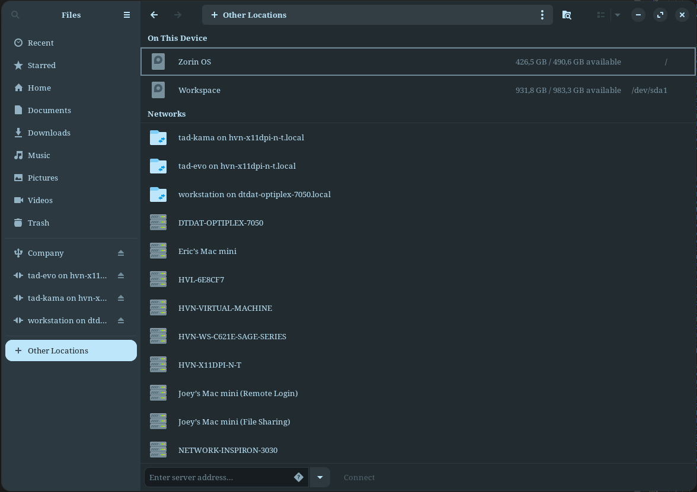

# \[Zorin\] Gvfs

> __Gvfs__ là viết tắt của __GNOME Virtual File System__.

Nó là một lớp hệ thống tập tin ảo nằm trên __*VFS (Virtual Filesystem Switch)*__ trong Linux và tích hợp với GNOME desktop environment (như là __Zorin OS__).

Hệ thống này tự động tìm kiếm các máy ảo có mở [Sambashare](linux-tools-sambashare.md) và hiển thị như một bộ nhớ ngoài được mã hóa và có thể tuy cập. Cái này tiện hơn [Windows](/OS/Windows/windows/) rất nhiều vì trên hệ điều hành Windows phải biết địa chỉ IP để cài đặt sambashare. Nhưng Zorin không cần thiết.

Vì một lý do nào đó Ubuntu gốc không có __GVFS__ nguyên bản thế nên phải đưa sang bên này.

Các thư mục sambashare nằm ở phân vùng __Other Location__. Ấn vào đó sẽ thấy các máy ảo cùng mạng có dùng __sambashare__ ở đấy.

<figure markdown="span">
    
    <figcaption></figcaption>
</figure>

Kết nối với máy ảo đó như bình thường, chỉ cần ấn vào là được. Sau đó nhập vào __ID/PASS__ được cài đặt phía bên máy khách.

Các tệp được kết nối sẽ có dạng `sambashare-server-name.local`, để biết địa chỉ máy khách chỉ cần dùng lệnh:

```bash
ping sambashare-server-name.local
```

Sau khi mouted thành công, các tệp sẽ được lưu ở `/run/user/1000/gvfs/`