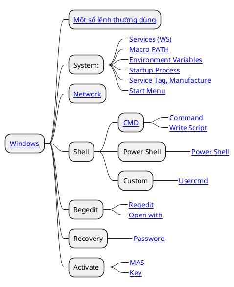

# Windows

```puml
@startmindmap
skinparam backgroundcolor transparent
!$URL="/OS/Windows/"

* [[$URL/windows Windows]]
** [[$URL/os-windows-cmd-Concept-command Một số lệnh thường dùng]]
** System:
***_ [[$URL/os-windows-services Services (WS)]]
***_ [[$URL/os-windows-Concept-path Macro PATH]]
***_ [[$URL/os-windows-environment-variables Environment Variables]]
***_ [[$URL/os-windows-startup-process Startup Process]]
***_ [[$URL/os-windows-service-tag-and-manufacture Service Tag, Manufacture]]
***_ [[$URL/os-windows-service-start-menu Start Menu]]
** [[$URL/os-windows-network Network]]
** Shell
*** [[$URL/os-windows-cmd CMD]]
****_ [[$URL/os-windows-cmd-command Command]]
****_ [[$URL/os-windows-cmd-write-scripts Write Script]]
*** Power Shell
****_ [[$URL/os-windows-ps-getting-start Power Shell]]
*** Custom
****_ [[$URL/os-windows-custom-usercmd Usercmd]]
** Regedit
***_ [[$URL/os-windows-regedit Regedit]]
***_ [[$URL/os-windows-custom-open-with Open with]]
** Recovery
***_ [[$URL/os-windows-recovery-password Password]]
** Activate
***_ [[$URL/os-windows-crack-by-mas MAS]]
***_ [[$URL/os-windows-buyed-key Key]]
@endmindmap
```