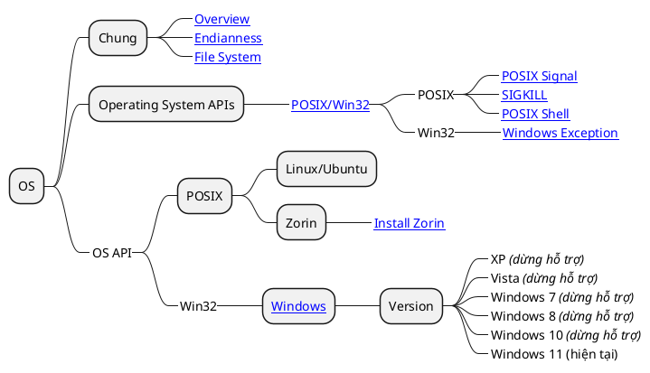

# OS

## Map

## Table

- **Cấu Trúc Tệp và Hệ Thống**
    - [Endianness](os-endianness.md) là về cách phân bổ các bit bộ nhớ.
    - [File System](os-file-system.md) nói về các hệ thống tệp, hệ thống phân loại tệp trong một số hệ điều hành khác nhau.