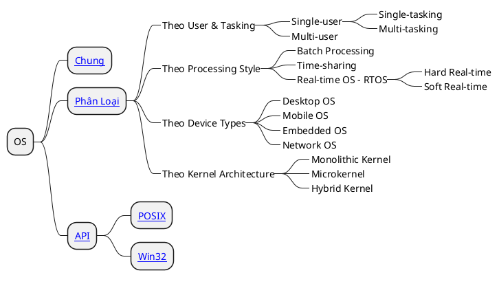

# OS

## Operating System

- Cuốn sách {{ book("Operating System", "operating-system") }} viết về hệ điều hành

### Tóm Tắt

```puml
@startmindmap

skinparam backgroundcolor transparent
!$URL = "http://localhost:65000/book/operating-system/"

* OS
** [[$URL/os.html Chung]]

** [[$URL/os-types.html Phân Loại]]
***_ Theo User & Tasking
****_ Single-user
*****_ Single-tasking
*****_ Multi-tasking
****_ Multi-user
***_ Theo Processing Style
****_ Batch Processing
****_ Time-sharing
****_ Real-time OS - RTOS
*****_ Hard Real-time
*****_ Soft Real-time
***_ Theo Device Types
****_ Desktop OS
****_ Mobile OS
****_ Embedded OS
****_ Network OS
***_ Theo Kernel Architecture
****_ Monolithic Kernel
****_ Microkernel
****_ Hybrid Kernel

** [[$URL/os-api.html API]]
*** [[$URL/os-posix.html POSIX]]
*** [[$URL/os-win32.html Win32]]


@endmindmap
```

## Table

- **Cấu Trúc Tệp và Hệ Thống**
    - [Endianness](os-endianness.md) là về cách phân bổ các bit bộ nhớ.
    - [File System](os-file-system.md) nói về các hệ thống tệp, hệ thống phân loại tệp trong một số hệ điều hành khác nhau.

/// html | div.hidden
- [Os Overview](os-overview.md)
///

## Linux

- {{ book("Sổ Tay Người Dùng Linux Distribution", "linux-distribution-user-manual") }}