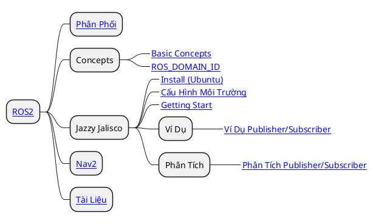

# ROS Robot Operating System

> Trang chủ: [https://www.ros.org/](https://www.ros.org/)

## Roadmap

## Getting Started

### Installation

ROS được phát hành dưới dạng bản phân phối, còn được gọi là “bản phân phối”, với nhiều bản phân phối ROS được hỗ trợ cùng một lúc. Một số bản phát hành có hỗ trợ dài hạn (LTS), nghĩa là chúng ổn định hơn và đã trải qua quá trình thử nghiệm rộng rãi. Các bản phân phối khác mới hơn với thời gian tồn tại ngắn hơn nhưng có hỗ trợ cho các nền tảng mới hơn và các phiên bản mới hơn của các gói ROS cấu thành của chúng. Xem [distributions list](http://docs.ros.org/) để biết thêm chi tiết. Nhìn chung, một bản phân phối ROS mới được phát hành hàng năm vào [world turtle day](https://www.worldturtleday.org/), với các bản phân phối LTS được phát hành vào những năm chẵn. Chúng tôi hiện đề xuất một trong các phiên bản dưới đây:

### Phiên bản

<mark class=red>ROS nên cài đặt trên hệ điều hành __Ubuntu__</mark>. __Windows__ và __macOS__ có hỗ trợ một phần nhưng không khuyến nghị. Nói chung cái này nó hơi tệ.

Các phiên bản khuyến nghị có là

|       Version        |  Ubuntu Noble (Numbat 24.04 LTS)   |
| :------------------: | :--------------------------------: |
|   __Kilted Kaiju__   |  Ubuntu Noble (Numbat 24.04 LTS)   |
|  __Jazzy Jalisco__   |  Ubuntu Noble (Numbat 24.04 LTS)   |
| __Humble Hawksbill__ | Ubuntu Jammy (Jellyfish 22.04 LTS) |
|    Rolling Ridley    |                                    |

## Important Notes on Installation

ROS là một phần mềm phức tạp hoạt động chặt chẽ với hệ điều hành và thư viện hệ thống trên máy tính của bạn. <mark>Do đó, chúng tôi xây dựng và thử nghiệm từng bản phân phối ROS chỉ với một số hệ điều hành mới nhất, chúng tôi gọi những hệ điều hành này là “cấp 1”. Mỗi bản phân phối ROS chỉ được xây dựng và thử nghiệm cho các hệ điều hành cấp 1 này, các hệ điều hành khác có thể yêu cầu nhiều công việc hơn đáng kể để chạy một bản phân phối ROS cụ thể.</mark> Về mặt thực tế, điều này có nghĩa là bạn sẽ có được trải nghiệm tốt nhất nếu sử dụng hệ điều hành cấp 1 mà chúng tôi đề xuất.

Ví dụ: ROS 2 Humble Hawksbill hoạt động tốt nhất trên Ubuntu 22.04 Jammy Jellyfish và Windows 10. Nếu cố cài đặt ROS trên bất kỳ hệ điều hành nào khác, bạn có thể gặp phải sự cố và chúng tôi không khuyến nghị điều này đối với người dùng mới. Để biết thêm thông tin về các bản phân phối ROS và hệ điều hành cấp 1 của chúng, vui lòng đọc [REP-2000](https://www.ros.org/reps/rep-2000.html).

Nếu bạn dự định sử dụng trình mô phỏng Gazebo với ROS, chúng tôi khuyên bạn nên tham khảo tài liệu Gazebo để biết phiên bản Gazebo được đề xuất cho quá trình cài đặt ROS của bạn. Không phải tất cả các phiên bản ROS và Gazebo đều tương thích, các phiên bản khác đều tương thích nhưng yêu cầu bạn xây dựng từ nguồn. Sử dụng kết hợp ROS và Gazebo được đề xuất sẽ cải thiện đáng kể trải nghiệm tổng thể của bạn. Cho dù bạn quyết định kết hợp nào, bạn sẽ cần sử dụng cầu nối ROS/GZ để kết nối hai phần mềm.

Nếu bạn là người dùng mới và muốn cài đặt phiên bản ROS hoặc ROS 2 mới nhất trên bất kỳ hệ điều hành nào ngoài hệ điều hành cấp 1 được liệt kê, chúng tôi khuyên bạn nên cài đặt hệ điều hành cấp 1 được đề xuất trong máy ảo rồi cài đặt ROS bên trong máy ảo. Ngoài ra, nếu bạn đã quen với Docker, bạn cũng có thể sử dụng ROS trong vùng chứa Docker.

## Yêu Cầu

- Để học được phần này yêu cầu cần có kiến thức căn bản về lập trình [C++]() và [Python](). [Make]() và [CMake]() cũng khá là cần thiết nếu muốn nghiên cứu sâu.
- `Colcon` là hệ thống xây dựng chính và xuyên suốt hệ thống __ROS__. Có thể học _(tùy chọn)_.

## Tài liệu Phân Phối

Xem Danh Mục Tài Liệu Tại [ROS2 Documents](ros-document.md)

### _Tài Liệu Ngoài Lề_

- [Turtlebot](https://turtlebot.github.io/turtlebot4-user-manual/)
- [Lidarbot](https://github.com/TheNoobInventor/lidarbot?tab=readme-ov-file#teleoperation)