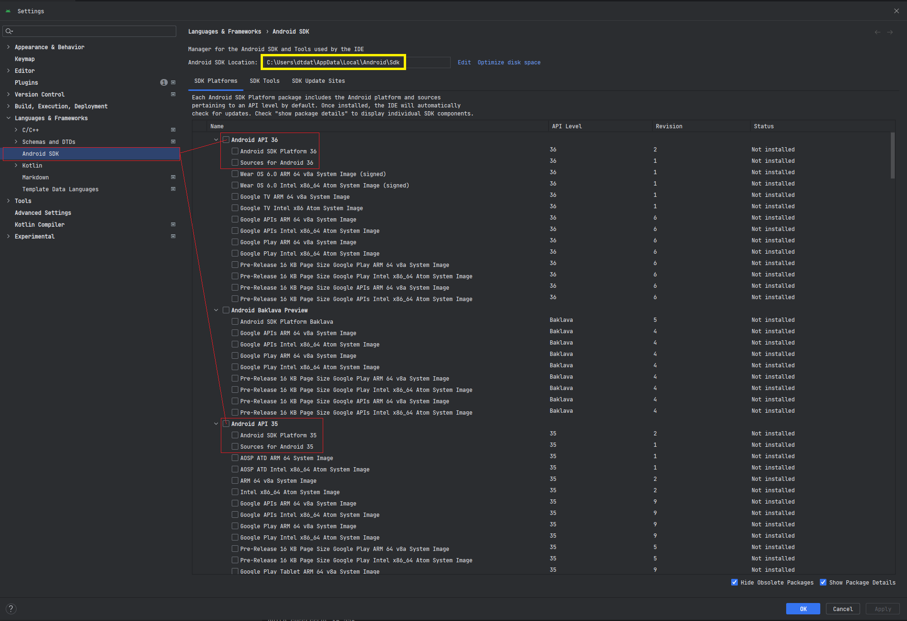

# SDK

## SDK là gì?

The Android SDK (Software Development Kit) is a set of tools, libraries, and documentation that developers use to build applications for the Android operating system. It provides everything needed to create, test, and debug Android apps, and includes things like a debugger, libraries, a device emulator, documentation, sample code, and tutorials.

___Android SDK__ <u>(Bộ phát triển phần mềm)</u> là một tập hợp các công cụ, thư viện và tài liệu mà các nhà phát triển sử dụng để xây dựng các ứng dụng cho hệ điều hành Android.Nó cung cấp mọi thứ cần thiết để tạo, kiểm tra và gỡ lỗi các ứng dụng Android và bao gồm những thứ như trình gỡ lỗi, thư viện, trình giả lập thiết bị, tài liệu, mã mẫu và hướng dẫn._

## Địa chỉ của SDK

### Windows

Thông thường SDK được cài đặt ở:

```batch
%USERPROFILE%\AppData\Local\Android\Sdk
```

Nếu không phải, có thể kiểm tra ở tệp `local.properties`:

```txt
## This file is automatically generated by Android Studio.
# Do not modify this file -- YOUR CHANGES WILL BE ERASED!
#
# This file should *NOT* be checked into Version Control Systems,
# as it contains information specific to your local configuration.
#
# Location of the SDK. This is only used by Gradle.
# For customization when using a Version Control System, please read the
# header note.
sdk.dir=C\:\\Users\\{name}\\AppData\\Local\\Android\\Sdk
```

Hoặc là vào trong phần cài đặt __SDK Manager__, đường dẫn của Sdk ở _ô màu vàng_, _ô màu đỏ_

<figure markdown="span">
    
    <figcaption>SDK Manager</figcaption>
</figure>

Tải về các gói trong ô màu đỏ, 2 gói được khuyến nghị là:

- [x] Android SDK Platform `<version>`
- [x] Source for Android `<version>`

!!! note "Note"
    - __Android SDK Platform__ phải có để phát triển ứng dụng.
    - __Source for ...__ được dùng khi muốn nghiên cứu sâu hơn trong API

### Linux

_Chắc Android Studio trên Linux cũng không có gì khác lắm. Nhưng mình chưa dùng nên chưa rõ._

## Chọn NDK nào

Để tìm được NDK đúng có thể xem bảng:

| Android Version Number | API Level | Android Version Name |
| :--------------------- | :-------: | :------------------- |
| Android 16             |    36     | Baklava              |
| Android 15             |    35     | Vanilla Ice Cream    |
| Android 14             |    34     | Upside Down Cake     |
| Android 13             |    33     | Tiramisu             |
| Android 12             |    32     | Snow Cone            |
| Android 12             |    31     | Snow Cone            |
| Android 11             |    30     | Red Velvet Cake      |
| Android 10             |    29     | Quince Tart          |
| Android  9             |    28     | Pie                  |
| Android  8             |    27     | Oreo                 |
| Android  8             |    26     | Oreo                 |
| Android  7             |    25     | Nougat               |
| Android  7             |    24     | Nougat               |

> _(Với các phiên bản lâu hơn nữa vui lòng tra bảng tại [đường dẫn này](https://apilevels.com/))_

Từ bảng đó để tìm ra __API__ phù hợp. Ví dụ với điện thoại _test_ của mình chạy ___Android 11___, suy ra hai gói cần tải đó là:

- [x] Android SDK Platform 30
- [x] Source for Android 30