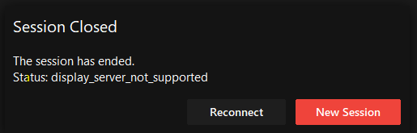

# AnyDesk

## Tổng quan

### Trang chủ

```bash
https://anydesk.com/en
```

### Tải về và cài đặt

#### Windown

```bash
wget https://download.anydesk.com/AnyDesk.exe
```

Tải về trực tiếp `AnyDesk.exe` và chạy thôi.

Nhưng quá trình sử dụng sẽ vướng _lisences_ thế nên hãy dùng bản crack này:

- [_Anydesk full không lisences (google drive)_](https://drive.google.com/file/d/12DIt9FGeRvLS7prDeDmb9ucBqC5L5k5X/view?usp=sharing)
- Nguồn: [_https://phanmemvui.com/anydesk-full-crack/_](https://phanmemvui.com/anydesk-full-crack/)

#### Linux

Với Linux tải về bản `anydesk_7.0.2-1_amd64.deb` tại:

```bash
wget https://download.anydesk.com/linux/anydesk_7.0.2-1_amd64.deb
```

Sau đó dùng lệnh sau để cài đặt:

```bash
sudo dpkg -i anydesk_7.0.2-1_amd64.deb
```

## Tùy chỉnh

Anydesk yêu cầu quyền __*Adminstrator*__ để được truy cập vào trong

=== "Windows"
    ```bash

    ```
=== "Linux"
    ```bash
    sudo anydesk --admin-settings
    ```

## Address

```txt
anydesk --get-id
```

## Troubleshot

### Lỗi display_server_not_supported

<figure markdown="span">
    
    <figcaption></figcaption>
</figure>

Lỗi này do ???, để sửa nó thì chạy lệnh sau:

```bash
sudo nano /etc/gdm3/custom.conf
```

Sau đó thêm dòng này vào mục `[daemon]`, kiểu kiểu này:

```txt
# GDM configuration storage
#
# See /usr/share/gdm/gdm.schemas for a list of available options.

[daemon]
AutomaticLoginEnable=true
AutomaticLogin=tad

# Uncomment the line below to force the login screen to use Xorg
WaylandEnable=false

# Enabling automatic login

# Enabling timed login
#  TimedLoginEnable = true
#  TimedLogin = user1
#  TimedLoginDelay = 10

[security]

[xdmcp]

[chooser]

[debug]
# Uncomment the line below to turn on debugging
# More verbose logs
# Additionally lets the X server dump core if it crashes
#Enable=true
```