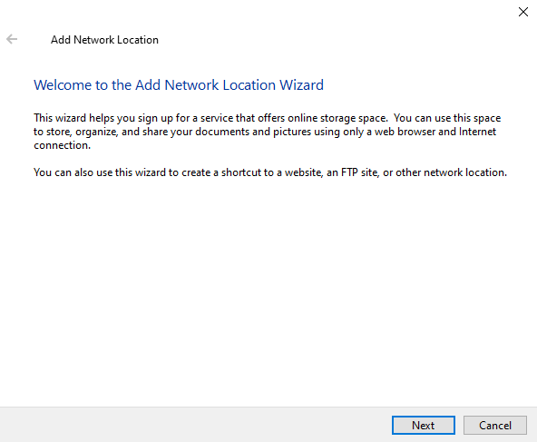
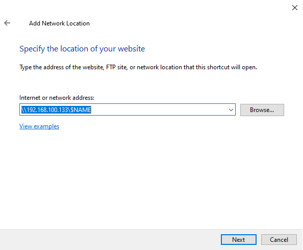

# Sambashare

## Giới Thiệu

- Đây là công cụ chia sẻ tệp. Nó có tác dụng chia sẻ tệp trên **Ubuntu** cho **Windows**. Tức là một thư mục nằm trên **Ubuntu** nhưng bạn có thể truy cập và sử dụng trực tiếp và sử dụng như thư mục trên **Windows**, vừa tối ưu hóa tài nguyên lại không mất công đổi thiết bị.
- Tệp sau khi được sửa đổi cũng thay đổi trên thiết bị đích luôn.
- **Sambashare** chỉ có trên Ubuntu

## Nội Dung

- [Tải Về](#tai-ve)
- [Cấu Hình](#cau-hinh)
    - [Tệp Sambashare Config](#tep-sambashare-config)
    - [Restart Smb Server](#restart-smb-server)
    - [Tạo Smb Accoount](#tao-smb-accoount)
- [Kết Nối](#ket-noi)
    - [Kết Nối Tệp Trên Windows](#ket-noi-tep-tren-windows)
    - [Kết Nối Tệp trên Ubuntu/Linux](#ket-noi-tep-tren-ubuntulinux)

## Tải Về

Trên Linux gõ lệnh sau để cài đặt

```bash
sudo apt update
sudo apt install samba
```

Kiểm tra lại xem cài đặt thành công chưa bằng lệnh

```bash
whereis samba
```
```bash title="Kết Quả"
samba: /usr/sbin/samba /usr/lib/samba /etc/samba /usr/share/samba /usr/share/man/man7/samba.7.gz /usr/share/man/man8/samba.8.gz
```

## Cấu Hình

### Tệp Sambashare Config

Chỉnh sửa tệp cấu hình sau để có quyền truy cập vào `sambashare`

=== "Sửa"
    ```bash
    sudo nano /etc/samba/smb.conf
    ```
=== "Đọc"
    ```bash
    sudo nano /etc/samba/smb.conf
    ```

Thêm đoạn sau vào trong tệp `smb.conf`

```text
[smb_name_id]
    comment = Samba on Ubuntu.  Not improtant
    path = home/pcname/
    read only = no
    browsable = yes
```

Với:
- `smb_name_id` là tên máy _**sambashare**_, nên nhớ thông tin này để đăng nhập.
- Cần chỉnh sửa `path`, đây là địa chỉ đường dẫn đến tệp bạn muốn chia sẻ.
- Hai thông số cuối <u>nên để như vậy</u>.

### Restart Smb Server

Sau đó thì _**restart smb server**_ để thấy sự thay đổi. Lệnh như sau:

```bash
sudo service smbd restart
sudo ufw allow samba
```

### Tạo Smb Accoount

Từ khi Sambashare quyết định sử dụng mật khẩu riêng, bạn cần lệnh này để tạo tài khoản _(account/pws)_ vào thiết bị

```bash
sudo smbpasswd -a your_account
```

- `your_account` không nhất thiết phải là `pcname`, bạn có thể tạo bất kỳ tên nào muốn.
- Không nên tạo lại tài khoản nhiều lần. Nếu lần sau muốn thêm một thư mục _**sambashare**_ khác, chỉ cần cấu hình lại ở tệp **smb.conf** là được

## Kết Nối

### Kết Nối Tệp Trên Windows

Ở **Explorer** chuột phải vào vùng **Network**, chọn _**Add a network location**_.

<figure markdown="span">
    
    <figcaption>Add a network location</figcaption>
</figure>

Rồi điền địa chỉ `ip` và `$NAME` ở trên vào.

<figure markdown="span">
    
    <figcaption>Select Sambashare Folder</figcaption>
</figure>

###  Kết Nối Tệp trên Ubuntu/Linux

1. Đầu tiên cần tải về công cụ
    ```bash
    sudo apt install cifs-utils
    ```
1. Tạo một thư mục để gán tệp, chẳng hạn gắn vào `~/share_folder`
    ```bash
    mkdir ~/share_folder
    ```
1. Gán địa chỉ ổ ảo vào `~/samba/$FOLDER`
    Dùng lệnh sau để gắn địa chỉ một tệp được chia sẻ qua sambashare với ổ của **Ubuntu**

    Thay giá trị của:

    - `$ip` là địa chỉ ip của server.
    - `smb_name_id` là tên được định nghĩa trong tệp _**smb.conf**_ ở bước [Tệp Sambashare Config](#tep-sambashare-config).
    - `~/share_folder` là địa chỉ trên máy muốn gắn tệp vào.

    === "Normal Password"
        ```bash
        sudo mount -t cifs //$ip/smb_name_id ~/share_folder -o username=dtdat,password=$PASS
        ```
    === "Spec. Password"
        _Trường hợp __$PASS__ có mỗi dấu cách thì làm như này_
        ```bash
        sudo mount -t cifs //$ip/smb_name_id ~/share_folder -o username=dtdat,password=\ ,iocharset=utf8
        ```

!!! danger "Lưu Ý:"
    Tệp sau khi được cấu hình sẽ gần như tệp hệ thống. Không nên xóa trực tiếp mà nên dùng `umount` trước để hủy kết nối với _**Sambashare Server**_ trước. Để ngắt kết nối thì trường hợp này dùng lệnh:

    ```bash
    sudo mount -t cifs //$ip/smb_name_id
    ```

    Sau đó có thể xóa tệp như bình thường.