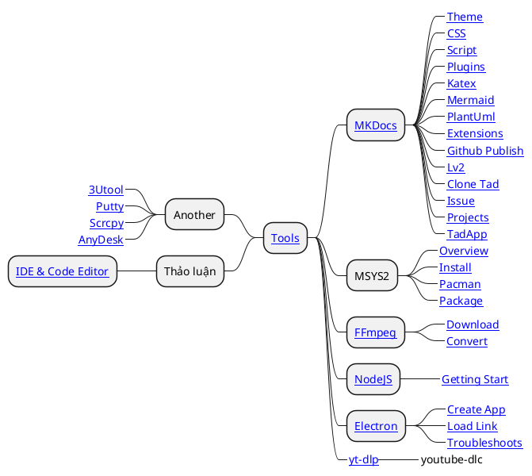

# Tools

```puml
@startmindmap
skinparam backgroundcolor transparent
!$URL = "/Tools"

* [[$URL/tools/ Tools]]
** [[$URL/MKDocs/mkdocs/ MKDocs]]
***_ [[$URL/MKDocs/mkdocs-theme/ Theme]]
***_ [[$URL/MKDocs/mkdocs-css/ CSS]]
***_ [[$URL/MKDocs/mkdocs-script/ Script]]
***_ [[$URL/MKDocs/mkdocs-plugins/ Plugins]]
***_ [[$URL/MKDocs/mkdocs-katex/ Katex]]
***_ [[$URL/MKDocs/mkdocs-mermaid/ Mermaid]]
***_ [[$URL/MKDocs/mkdocs-plantuml/ PlantUml]]
***_ [[$URL/MKDocs/mkdocs-markdown-extensions/ Extensions]]
***_ [[$URL/MKDocs/mkdocs-github-publish/ Github Publish]]
***_ [[$URL/MKDocs/mkdocs_lv2/ Lv2]]
***_ [[$URL/MKDocs/mkdocs-clone-tad-style/ Clone Tad]]
***_ [[$URL/MKDocs/mkdocs-issue/ Issue]]
***_ [[$URL/MKDocs/mkdocs-projects/ Projects]]
***_ [[$URL/MKDocs/mkdocs-for-tadapp/ TadApp]]
** MSYS2
***_ [[$URL/msys2/msys2/ Overview]]
***_ [[$URL/msys2/msys2-install/ Install]]
***_ [[$URL/msys2/msys2-pacman/ Pacman]]
***_ [[$URL/msys2/msys2-package/ Package]]
** [[$URL/FFmpeg/ffmpeg/ FFmpeg]]
***_ [[$URL/FFmpeg/ffmpeg-download/ Download]]
***_ [[$URL/FFmpeg/ffmpeg-convert/ Convert]]
** [[$URL/NodeJS/nodejs/ NodeJS]]
***_ [[$URL/NodeJS/nodejs-getting-start/ Getting Start]]
** [[$URL/Electron/electron/ Electron]]
***_ [[$URL/Electron/electron-create-app/ Create App]]
***_ [[$URL/Electron/electron-load-link/ Load Link]]
***_ [[$URL/Electron/electron-troubleshoots/ Troubleshoots]]
**_ [[$URL/yt-dlp/yt-dlp/ yt-dlp]]
***_ youtube-dlc

left side
** Another
***_ [[$URL/Other/3utools/ 3Utool]]
***_ [[$URL/Other/putty/ Putty]]
***_ [[$URL/Other/scrcpy/ Scrcpy]]
***_ [[$URL/AnyDesk/anydesk/ AnyDesk]]
** Thảo luận
*** [[$URL/paper-ide-code-editor/ IDE & Code Editor]]
@endmindmap
```