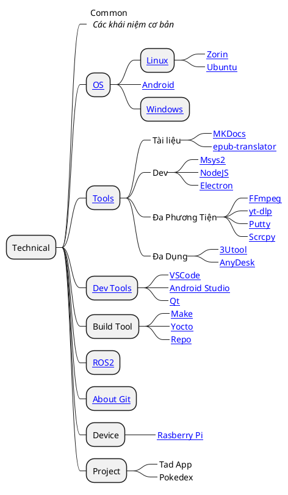

# Preface

## Mô Tả

Các tài liệu về

- Hệ điều hành, công cụ và các thuật ngữ chung.
- Công nghệ và mô tả
- Các công cụ và cách sử dụng công cụ, cấu hình công cụ phục vụ mục đích học tập.

## Cấu Trúc

## About this Document

Đây là trang web tổng hợp lại các tài liệu, kiến thức lặt vặt về lập trình (và riêng về máy tính với lập trình) của mình. Có khá nhiều khía cạnh khác nhau ngoài khía cạnh chính được đề cập trong tài liệu này. Chủ yếu tài liệu này chính là để hỗ trợ mình làm việc trong cả công việc và cuộc sống.

Trong tất cả thì trang này là trang chủ chứa khá nhiều thông tin. Chủ đề chính là nghiêng về phía __Khoa học máy tính__, chuyên nghành chính cái mà mình cả học tập lẫn tìm hiểu nhiều nhất.

Nội dung của cục này xoay quanh nhiều các vấn đề về lập trình như OOP, học các ngôn ngữ lập trình, hệ điều hành, ..

## Một số nội dung tiếp tục

!!! note "Note"

    __ffmpeg:__
    
    - Nghiên cứu về cách dùng và nhúng chúng vào trong dự ans
    
    __gstreamer:__

    - Xây dựng đường ống
    - Truyền UDP và __*MultiCasting*__
    
    __Android + Kotlin__

    Tham khảo nhiều hơn các dự án ở [AndyHa23](https://github.com/AndyHa23/), đặc biệt:

    - [_gstreamer-android-samples_](https://github.com/AndyHa23/gstreamer-android-samples): Ví dụ về gstreamer cho Android. Mình biết cái này đầu tiên.
    - [_android-core-architecture_](https://github.com/AndyHa23/android-core-architecture): Một số kiến trúc lập trình ứng dụng căn bản dành cho nhiều mục đích. <mark>Dự án này đáng để tham khảo và phát triển để mở rộng vốn hiểu biết về nhiều mặt khác nhau nữa của lập trình Kotlin</mark>.
        - [_android-core-architecture-lite_](https://github.com/AndyHa23/android-core-architecture-lite)
    - [_wifi-p2p-streaming_](https://github.com/AndyHa23/wifi-p2p-streaming): Về các dự án truyền dẫn Camera
    - [_paymentwall-android-sdk_](https://github.com/AndyHa23/paymentwall-android-sdk): Hệ thống thanh toán online